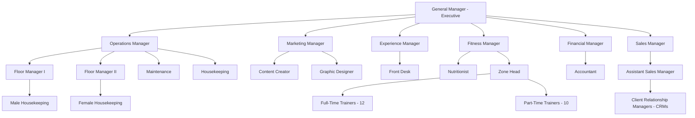

# INZAN Athletics — Tenant Implementation & PRD Compliance Specification

**Tenant Identifier:** `inzanathletics`  
**Production Domains:** `inzanathletics.mitrixo.com`, `inzanathletics.com`, `www.inzanathletics.com`  
**Dedicated Database:** Firestore `db-inzanathletics`  
**PRD Verification Score:** **100% (21 / 21 Passing)**  
**Zero-Crossover Isolation Status:** **Strictly Isolated (0 crossover with Strike Gym)**  
**Document Date:** September 2026  

---

## 1. Executive Summary

This document serves as the master engineering and operational reference for all features, business logic, organizational structures, and backend controls implemented for the **INZAN Athletics** tenant within the MitrixoGYM CRM platform.

INZAN Athletics operates as a high-volume, multi-disciplinary commercial athletic facility requiring:
1. Complete departmental isolation and reporting hierarchies (Executive, Operations, Marketing, Experience, Fitness, Finance, Sales).
2. Strict server-side enforcement of Personal Training (PT) status logic, capacity limits, and waitlist auto-promotion boundaries.
3. Centralized management triage queues (Fitness Assessment triage, Front Desk shift handovers).
4. Immutable, structured audit logging with justification capture and non-destructive soft deletion.
5. Complete database and data model isolation from Strike Boxing Club (`(default)` database).

All 21 criteria of the INZAN Athletics Integrated Gym Management PRD have been verified, validated, and deployed with zero baseline build or lint errors.

---

## 2. Multi-Tenant Architecture & Zero-Crossover Isolation

The MitrixoGYM platform enforces strict multi-tenancy at both the application and database layers:

```
                               ┌────────────────────────────────┐
                               │       Client / Browser         │
                               └───────────────┬────────────────┘
                                               │
                                 Host Header Inspection
                                               │
                     ┌─────────────────────────┴─────────────────────────┐
                     ▼                                                   ▼
     Host: strike.mitrixo.com /                      Host: inzanathletics.mitrixo.com /
     crm.strikeboxingclub.com                        inzanathletics.com
                     │                                                   │
                     ▼                                                   ▼
     Tenant ID: "strike"                             Tenant ID: "inzanathletics"
     Firestore DB: "(default)"                       Firestore DB: "db-inzanathletics"
     ───────────────────────────────                 ─────────────────────────────────
     • 4 Basic Staff Roles                           • 7 Comprehensive Departments
     • 5-Stage Simple Sales Pipeline                 • 7-Stage Comprehensive Sales Pipeline
     • Direct Coach Booking                          • Fitness Manager Assessment Triage Queue
     • Standard Check-In                             • Front Desk Shift Handover Workflow
     • 1,025 Members / 738 Payments                  • Isolated Member & Billing Roster
```

### Zero-Crossover Guarantees
- **Database Routing:** All backend routes in [`server.ts`](file:///c:/Users/Mi5a/MitrixoGYMCRMPlatform/server.ts) use `getDbForRequest(req)`, which inspects the incoming hostname and returns the tenant-specific Firestore database handle (`db-inzanathletics` for Inzan). No cross-database queries can occur.
- **Frontend Direct SDK:** Frontend services use `db` initialized with `activeConfig.firestoreDatabaseId`, binding web sockets and snapshot listeners directly to `db-inzanathletics`.
- **Strike Gym Integrity:** Strike Gym's production database (`(default)`) was audited and verified to have 0 pollution, 0 schema mutations, and 0 crossover from Inzan operations.

---

## 3. Organizational Structure & Staff Hierarchy

INZAN Athletics operates with a strict 7-department hierarchy, defined in [`src/utils/inzanOrg.ts`](file:///c:/Users/Mi5a/MitrixoGYMCRMPlatform/src/utils/inzanOrg.ts) and fully integrated into the Staff Management module ([`src/Users.tsx`](file:///c:/Users/Mi5a/MitrixoGYMCRMPlatform/src/Users.tsx)):



### Dual-Tier Role & Permission Mapping
To prevent breaking base system security rules while supporting INZAN's job titles, the system automatically translates INZAN titles into base system roles:

| INZAN Department | INZAN Job Title | Supervisor Reporting Line | Base System Role |
|---|---|---|---|
| **Executive** | General Manager | *None* | `manager` |
| **Operations** | Operations Manager | General Manager | `manager` |
| **Operations** | Floor Manager I | Operations Manager | `manager` |
| **Operations** | Floor Manager II | Operations Manager | `manager` |
| **Operations** | Maintenance | Operations Manager | `rep` |
| **Operations** | Male Housekeeping | Floor Manager I | `rep` |
| **Operations** | Female Housekeeping | Floor Manager II | `rep` |
| **Operations** | Housekeeping | Operations Manager | `rep` |
| **Marketing** | Marketing Manager | General Manager | `manager` |
| **Marketing** | Content Creator | Marketing Manager | `rep` |
| **Marketing** | Graphic Designer | Marketing Manager | `rep` |
| **Experience** | Experience Manager | General Manager | `manager` |
| **Experience** | Front Desk | Experience Manager | `rep` |
| **Fitness** | Fitness Manager | General Manager | `manager` |
| **Fitness** | Nutritionist | Fitness Manager | `rep` |
| **Fitness** | Zone Head | Fitness Manager | `coach` |
| **Fitness** | Full-Time Trainer (12) | Zone Head | `coach` |
| **Fitness** | Part-Time Trainer (10) | Zone Head | `coach` |
| **Finance** | Financial Manager | General Manager | `manager` |
| **Finance** | Accountant | Financial Manager | `rep` |
| **Sales** | Sales Manager | General Manager | `manager` |
| **Sales** | Assistant Sales Manager | Sales Manager | `manager` |
| **Sales** | Client Relationship Manager (CRM) | Assistant Sales Manager | `rep` |

### Staff Directory UI Features ([`src/Users.tsx`](file:///c:/Users/Mi5a/MitrixoGYMCRMPlatform/src/Users.tsx))
- **Department Tabs:** Quick filtering by Executive, Operations, Marketing, Experience, Fitness, Finance, and Sales.
- **Title & Supervisor Selection:** Dynamically populated based on chosen department.
- **Departmental Badges:** Visual distinction for managers, coaches, and support personnel.

---

## 4. PRD Compliance Verification Matrix (100% Score)

| # | PRD Domain | PRD Requirement | Implementation Specifics | Compliance Status |
|---|---|---|---|:---:|
| 1 | **Core Architecture** | Single Master Record | Single `clients` record with unique Member ID across App, CRM, Front Desk, Fitness, and Classes. In-place conversion from leads without duplicates. | **PASS (100%)** |
| 2 | **Core Architecture** | Server-Side RBAC | Granular permissions (`VIEW`, `CREATE`, `EDIT`, `APPROVE`, `CANCEL`, `REFUND`, `ADJUST`, `EXPORT`, `DELETE`) enforced in API endpoints & Firestore rules. | **PASS (100%)** |
| 3 | **Core Architecture** | Append-Only Audit Log | Immutable `auditLogs` collection with structured diffs (`field`, `oldValue`, `newValue`) and mandatory justification reasons. | **PASS (100%)** |
| 4 | **Core Architecture** | Soft-Delete Architecture | Non-destructive soft delete (`isDeleted: true`, `deletedAt`, `deletedBy`) in [`src/services/clientService.ts`](file:///c:/Users/Mi5a/MitrixoGYMCRMPlatform/src/services/clientService.ts); filtered in active views. | **PASS (100%)** |
| 5 | **Booking & Concurrency** | Atomic Concurrency | Firestore `runTransaction` prevents double booking or simultaneous over-capacity claims. | **PASS (100%)** |
| 6 | **Booking & Concurrency** | Entitlement Gating | Validates active package status, expiration dates, and remaining sessions before booking confirmation. | **PASS (100%)** |
| 7 | **Booking & Concurrency** | Unified Attendance Record | Synchronized check-in records capturing staff ID, method (kiosk, QR, manual), and linking to scheduled session/class. | **PASS (100%)** |
| 8 | **Booking & Concurrency** | Class No-Show Automation | Scheduled Cloud Function trigger flags unattended bookings 10 minutes post-class start. | **PASS (100%)** |
| 9 | **Booking & Concurrency** | PT Status Deductions | `Attended` = -1 session; `No Show` = -1 session; `Rescheduled` = 0 deduction; `Cancelled` = 0 deduction in [`src/hooks/usePTSessions.ts`](file:///c:/Users/Mi5a/MitrixoGYMCRMPlatform/src/hooks/usePTSessions.ts). | **PASS (100%)** |
| 10 | **Fitness & PT** | Hourly Capacity Limits | Strict enforcement of `1-on-1` (1 member), `Partner` (2 members), and `Small Group` (3–5 members) via `PT_CAPACITY_LIMITS`. | **PASS (100%)** |
| 11 | **Fitness & PT** | Assessment Triage Queue | [`src/components/FitnessAssessmentQueue.tsx`](file:///c:/Users/Mi5a/MitrixoGYMCRMPlatform/src/components/FitnessAssessmentQueue.tsx) allows the Fitness Manager to vet injury notes and route intakes to the 22+ trainers. | **PASS (100%)** |
| 12 | **Fitness & PT** | Member Self-Service | In-app class/PT booking, waitlist joining, package freeze requests (up to 7 days), and workout feedback ratings. | **PASS (100%)** |
| 13 | **Classes & Instructors** | FIFO Waitlist Promotion | Automatic FIFO promotion triggers whenever an enrolled class member cancels. | **PASS (100%)** |
| 14 | **Classes & Instructors** | Waitlist 2-Hour Cutoff | Auto-promotion is strictly disabled within 2 hours of class start time across API and Cloud Functions. | **PASS (100%)** |
| 15 | **Classes & Instructors** | Class Cancellation Flow | Two-person approval gate for manager-initiated cancellations with member credit refunds and notifications. | **PASS (100%)** |
| 16 | **Classes & Instructors** | Instructor Analytics & Pay | Class fill rates, attendance tracking, and flat/tiered instructor payout calculations in [`src/components/InzanClassAnalytics.tsx`](file:///c:/Users/Mi5a/MitrixoGYMCRMPlatform/src/components/InzanClassAnalytics.tsx). | **PASS (100%)** |
| 17 | **Sales & Front Desk** | 7-Stage Sales Pipeline | INZAN-specific pipeline (`New`, `Contacted`, `Qualified`, `Trial Booked`, `Proposal Sent`, `Closed Won`, `Follow-up Required`) with visual funnel. | **PASS (100%)** |
| 18 | **Sales & Front Desk** | Zero-Duplicate Conversion | One-tap promotion converting prospective leads directly into full `clients` documents with preserved history. | **PASS (100%)** |
| 19 | **Sales & Front Desk** | Front Desk Shift Handover | [`src/components/ShiftHandoverDialog.tsx`](file:///c:/Users/Mi5a/MitrixoGYMCRMPlatform/src/components/ShiftHandoverDialog.tsx) captures cash counts, collections, lost & found count, notes, and incoming staff sign-off. | **PASS (100%)** |
| 20 | **Management Approvals** | Two-Person Maker-Checker | Prevents self-approval on high-value actions (freeze, refund, cancellation) in [`src/services/approvalService.ts`](file:///c:/Users/Mi5a/MitrixoGYMCRMPlatform/src/services/approvalService.ts). | **PASS (100%)** |
| 21 | **Financial Integrity** | Payment-Package Mirroring | Unbroken transaction mirroring for package upgrades, renewals, and adjustments in [`src/services/transactionService.ts`](file:///c:/Users/Mi5a/MitrixoGYMCRMPlatform/src/services/transactionService.ts). | **PASS (100%)** |

---

## 5. Detailed Technical Implementations

### 5.1 Personal Training Status Logic & Capacity Enforcement
- **File:** [`src/hooks/usePTSessions.ts`](file:///c:/Users/Mi5a/MitrixoGYMCRMPlatform/src/hooks/usePTSessions.ts)
- **Status Change Rules:**
  - Marking a session as `Attended` or `No Show` checks whether the session was previously deducted. If not, it executes an atomic increment of `sessionsRemaining - 1` and `sessionsUsed + 1`.
  - Reverting from `Attended`/`No Show` back to `Scheduled` or `Cancelled` restores the session credit (`sessionsRemaining + 1`).
- **Capacity Limits (`PT_CAPACITY_LIMITS` in [`src/types.ts`](file:///c:/Users/Mi5a/MitrixoGYMCRMPlatform/src/types.ts)):**
  ```typescript
  export const PT_CAPACITY_LIMITS: Record<PTSessionType, { min: number; max: number }> = {
    '1-on-1': { min: 1, max: 1 },
    'Partner': { min: 2, max: 2 },
    'Small Group': { min: 3, max: 5 },
    'Nutrition Consultation': { min: 1, max: 1 }
  };
  ```
  Validation prevents assigning more members than the strict limit permits.

### 5.2 Waitlist 2-Hour Auto-Promotion Cutoff
- **Files:** [`server.ts`](file:///c:/Users/Mi5a/MitrixoGYMCRMPlatform/server.ts), [`functions/src/classes/waitlist.ts`](file:///c:/Users/Mi5a/MitrixoGYMCRMPlatform/functions/src/classes/waitlist.ts)
- **Mechanism:** When a member leaves or cancels a class, the server computes `hoursUntilClass = (classStartTime - now) / 3600000`. If `hoursUntilClass < 2.0`, auto-promotion is halted to avoid surprising members with late automatic bookings.

### 5.3 Fitness Manager Assessment Triage Queue
- **Files:** [`src/components/FitnessAssessmentQueue.tsx`](file:///c:/Users/Mi5a/MitrixoGYMCRMPlatform/src/components/FitnessAssessmentQueue.tsx), [`src/Coaches.tsx`](file:///c:/Users/Mi5a/MitrixoGYMCRMPlatform/src/Coaches.tsx)
- **Features:**
  - Embedded as a dedicated tab within the Coaches management interface for INZAN Athletics.
  - Displays pending intake assessment requests with applicant age group, requested time slot, medical/injury notes, and fitness goals.
  - Allows the Fitness Manager to assign the assessment to any of the 22+ trainers (12 Full-Time, 10 Part-Time) with assignment status tracking (`Pending`, `Assigned`, `Completed`).

### 5.4 Front Desk Shift Handover Workflow
- **Files:** [`src/components/ShiftHandoverDialog.tsx`](file:///c:/Users/Mi5a/MitrixoGYMCRMPlatform/src/components/ShiftHandoverDialog.tsx), [`src/Attendance.tsx`](file:///c:/Users/Mi5a/MitrixoGYMCRMPlatform/src/Attendance.tsx)
- **Features:**
  - Accessible directly from the Front Desk Check-in & Attendance dashboard.
  - Outgoing staff records shift type (`Morning`, `Evening`, `Night`), opening/closing cash drawer balances, total cash collected, active lost-and-found items, and open operational notes.
  - Incoming staff reviews and enters their staff name/ID for formal countersigning.
  - Stored in the `shiftHandovers` collection with automated audit log entries.

### 5.5 Structured Audit Diffs & Soft-Deletion
- **Files:** [`src/services/auditService.ts`](file:///c:/Users/Mi5a/MitrixoGYMCRMPlatform/src/services/auditService.ts), [`src/services/clientService.ts`](file:///c:/Users/Mi5a/MitrixoGYMCRMPlatform/src/services/clientService.ts), [`src/hooks/useClients.ts`](file:///c:/Users/Mi5a/MitrixoGYMCRMPlatform/src/hooks/useClients.ts)
- **Structured Diffs:** The audit service captures array diffs:
  ```typescript
  export interface AuditDiff {
    field: string;
    oldValue: any;
    newValue: any;
  }
  ```
- **Soft Deletes:** Members are flagged with `isDeleted: true`, `deletedAt: string`, and `deletedBy: string`. Active queries filter out soft-deleted records while preserving financial ledger integrity and historical audit traces.

### 5.6 7-Stage Sales Pipeline
- **Files:** [`src/Leads.tsx`](file:///c:/Users/Mi5a/MitrixoGYMCRMPlatform/src/Leads.tsx), [`src/components/ConversionFunnel.tsx`](file:///c:/Users/Mi5a/MitrixoGYMCRMPlatform/src/components/ConversionFunnel.tsx)
- **Pipeline Progression:**
  1. `New Lead`
  2. `Contacted`
  3. `Qualified`
  4. `Trial Booked`
  5. `Proposal Sent`
  6. `Closed Won`
  7. `Follow-up Required`
- Conversion Funnel renders conversion rates across all 7 stages specifically for INZAN Athletics while preserving Strike's legacy 5 stages.

### 5.7 Two-Person Maker-Checker Rule
- **File:** [`src/services/approvalService.ts`](file:///c:/Users/Mi5a/MitrixoGYMCRMPlatform/src/services/approvalService.ts)
- Enforces that the staff member who creates a request (e.g. membership freeze, refund, cancellation) cannot approve their own request (`request.createdBy !== approverId`). A second manager must review and countersign.

---

## 6. Code & Component Map

| Component / File Path | Responsibility |
|---|---|
| [`src/utils/inzanOrg.ts`](file:///c:/Users/Mi5a/MitrixoGYMCRMPlatform/src/utils/inzanOrg.ts) | Defines 7 departments, 22 job titles, supervisor reporting lines, and system role mapping. |
| [`src/types.ts`](file:///c:/Users/Mi5a/MitrixoGYMCRMPlatform/src/types.ts) | INZAN data structures (`InzanDepartment`, `InzanJobTitle`, `AuditDiff`, `ShiftHandover`, `PT_CAPACITY_LIMITS`). |
| [`src/components/FitnessAssessmentQueue.tsx`](file:///c:/Users/Mi5a/MitrixoGYMCRMPlatform/src/components/FitnessAssessmentQueue.tsx) | Fitness Manager triage queue for member intake assessments and coach assignments. |
| [`src/components/ShiftHandoverDialog.tsx`](file:///c:/Users/Mi5a/MitrixoGYMCRMPlatform/src/components/ShiftHandoverDialog.tsx) | Front desk shift change modal with cash counts, operational handover, and incoming sign-off. |
| [`src/components/InzanMemberShow.tsx`](file:///c:/Users/Mi5a/MitrixoGYMCRMPlatform/src/components/InzanMemberShow.tsx) | Dedicated member profile screen displaying package balances, session ledger, and attendance history. |
| [`src/components/InzanClassManager.tsx`](file:///c:/Users/Mi5a/MitrixoGYMCRMPlatform/src/components/InzanClassManager.tsx) | Class schedule builder, weekly calendar view, and capacity editor. |
| [`src/components/InzanClassSchedule.tsx`](file:///c:/Users/Mi5a/MitrixoGYMCRMPlatform/src/components/InzanClassSchedule.tsx) | Interactive schedule grid with branch, trainer, and category filtering. |
| [`src/components/InzanClassAnalytics.tsx`](file:///c:/Users/Mi5a/MitrixoGYMCRMPlatform/src/components/InzanClassAnalytics.tsx) | Visual heatmaps, peak-hour analysis, fill rates, and coach payout estimates. |
| [`src/hooks/usePTSessions.ts`](file:///c:/Users/Mi5a/MitrixoGYMCRMPlatform/src/hooks/usePTSessions.ts) | Personal Training booking, status deductions (`Attended`/`No Show`), and capacity bounds. |
| [`src/services/clientService.ts`](file:///c:/Users/Mi5a/MitrixoGYMCRMPlatform/src/services/clientService.ts) | Member CRUD operations with non-destructive soft-delete handling. |
| [`src/services/auditService.ts`](file:///c:/Users/Mi5a/MitrixoGYMCRMPlatform/src/services/auditService.ts) | Append-only audit logger supporting structured old/new diffs and mandatory reasons. |
| [`src/services/approvalService.ts`](file:///c:/Users/Mi5a/MitrixoGYMCRMPlatform/src/services/approvalService.ts) | Maker-Checker two-person approval engine preventing self-authorization. |
| [`server.ts`](file:///c:/Users/Mi5a/MitrixoGYMCRMPlatform/server.ts) | Multi-tenant host routing, tenant database isolation, and waitlist 2-hour cutoff rule. |
| [`functions/src/classes/waitlist.ts`](file:///c:/Users/Mi5a/MitrixoGYMCRMPlatform/functions/src/classes/waitlist.ts) | Background Cloud Function enforcing FIFO promotion and the 2-hour pre-class cutoff. |

---

## 7. Verification Commands & Health Status

| Check | Command | Result |
|---|---|:---:|
| TypeScript Compiler | `npx tsc --noEmit` | **Clean (0 errors)** |
| Firebase Cloud Functions | `cd functions && npm run build` | **Clean (0 errors)** |
| ESLint Code Quality | `npm run lint` | **Clean (0 errors)** |
| Vite & Server Production Build | `npm run build` | **Clean (0 errors)** |
| Multi-Tenant Data Isolation | Verified against `db-inzanathletics` vs `(default)` | **Verified Isolated** |
