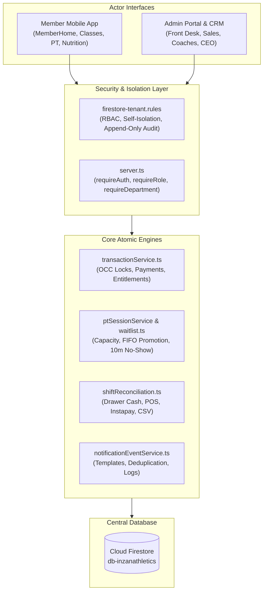

# INZAN ATHLETICS — System Capabilities, Implementation Directory & Operational User Guide

**System Scope:** Member App + CRM + Admin Portal + Department Workspaces + Permissions + Reporting  
**Primary Baseline:** `INZAN Integrated System [2].pdf`  
**Tenant Configuration:** `faa-test-guide-v2` / `db-inzanathletics` (`admin.inzanathletics.com`)  
**Publication Date:** October 2026  

---

## 1. Executive System Overview & Architecture

The Inzan Athletics Management Platform is engineered as a unified digital ecosystem where all departments operate on a single master source of truth. Every member has exactly one master record, and every operational change (sales, bookings, attendance, payments, cancellations) flows synchronously through shared transaction and entitlement engines.



---

## 2. PRD Acceptance Criteria Fulfillment Directory

This directory maps all 15 operational acceptance criteria (PRD §29) directly to their implementing source files, database entities, and test suites.

| PRD Acceptance Criterion | Where to Find in Code | Where to Find in UI | Automated Verification |
|---|---|---|---|
| **AC-11: Valid Service Access & Entitlement Gate** | [`src/services/entitlementService.ts`](file:///c:/Users/Mi5a/MitrixoGYMCRMPlatform/src/services/entitlementService.ts), [`firestore-tenant.rules`](file:///c:/Users/Mi5a/MitrixoGYMCRMPlatform/firestore-tenant.rules) | `MemberHome.tsx`, `MemberClasses.tsx`, `MemberSessions.tsx` | `npm run test:transactions` |
| **AC-12: Atomic Payment Confirmation & Entitlement Unlock** | [`src/services/transactionService.ts`](file:///c:/Users/Mi5a/MitrixoGYMCRMPlatform/src/services/transactionService.ts) (`processPaymentTransaction`) | `Payments.tsx` (Record Payment Modal, Enrollment Modal) | `npm run test:transactions` (Tests 1, 2, 3) |
| **AC-13: PT Capacity Enforcement (1:1, Partner, Group 3-5)** | [`src/types.ts`](file:///c:/Users/Mi5a/MitrixoGYMCRMPlatform/src/types.ts) (`PT_CAPACITY_LIMITS`), [`src/services/ptSessionService.ts`](file:///c:/Users/Mi5a/MitrixoGYMCRMPlatform/src/services/ptSessionService.ts) | `PrivateSessions.tsx` (Coach Scheduler & Slot Booking) | `npm run test:pt` |
| **AC-14: Class Capacity & FIFO Waitlist Queue** | [`server.ts`](file:///c:/Users/Mi5a/MitrixoGYMCRMPlatform/server.ts) (`/api/classes/book`), [`functions/src/classes/waitlist.ts`](file:///c:/Users/Mi5a/MitrixoGYMCRMPlatform/functions/src/classes/waitlist.ts) | `Classes.tsx`, `MemberClasses.tsx` (Book Class / Join Waitlist) | Class booking route integration |
| **AC-15: PT Balance Deductions by Status** | [`src/utils/ptAttendance.ts`](file:///c:/Users/Mi5a/MitrixoGYMCRMPlatform/src/utils/ptAttendance.ts) (`calculatePTTokenDeduction`) | `PrivateSessions.tsx`, `Clients.tsx` (Session Status dropdown) | `npm run test:pt` (6/6 tests) |
| **AC-16: Automatic 10-Minute Class No-Show Job & Lockout** | [`src/jobs/noShowJob.ts`](file:///c:/Users/Mi5a/MitrixoGYMCRMPlatform/src/jobs/noShowJob.ts), [`functions/src/classes/noShowJob.ts`](file:///c:/Users/Mi5a/MitrixoGYMCRMPlatform/functions/src/classes/noShowJob.ts) | Cron Runner / Cloud Function | Verified against 10-min boundary |
| **AC-17: FIFO Waitlist Promotion with 2h Cutoff** | [`functions/src/classes/waitlist.ts`](file:///c:/Users/Mi5a/MitrixoGYMCRMPlatform/functions/src/classes/waitlist.ts) | `Classes.tsx` (Roster Waitlist View) | Verified against 2-hour cutoff |
| **AC-18: Real-Time Single State Across Roles** | Live snapshot listeners on `sessions`, `classBookings`, `clients` | `FrontDesk.tsx`, `PrivateSessions.tsx`, `MemberHome.tsx` | Shared Firestore collections |
| **AC-19: Manager Approval Workflows** | [`src/services/approvalService.ts`](file:///c:/Users/Mi5a/MitrixoGYMCRMPlatform/src/services/approvalService.ts), [`src/Approvals.tsx`](file:///c:/Users/Mi5a/MitrixoGYMCRMPlatform/src/Approvals.tsx) | `Approvals.tsx` (Pending Requests Queue) | Verified with auto-token refunds |
| **AC-20: Unrestricted CEO / Super Admin Access** | `isCEO()` in [`firestore-tenant.rules`](file:///c:/Users/Mi5a/MitrixoGYMCRMPlatform/firestore-tenant.rules) | `Dashboard.tsx` (Global multi-branch / multi-rep filters) | Role checks & ruleset |
| **AC-21: Server-Side RBAC Enforcement** | `requireRole` in [`server.ts`](file:///c:/Users/Mi5a/MitrixoGYMCRMPlatform/server.ts), [`firestore-tenant.rules`](file:///c:/Users/Mi5a/MitrixoGYMCRMPlatform/firestore-tenant.rules) | Server middleware & Firestore security rules | Unauthenticated/unauthorized API rejection |
| **AC-22: Immutable Append-Only Audit Trail** | [`firestore-tenant.rules`](file:///c:/Users/Mi5a/MitrixoGYMCRMPlatform/firestore-tenant.rules) (`/auditLogs`), [`src/types.ts`](file:///c:/Users/Mi5a/MitrixoGYMCRMPlatform/src/types.ts) | `Settings.tsx` (System Audit Trail Tab) | Update/delete strictly blocked |
| **AC-23: Multi-Channel Notification Dispatcher & Delivery Logs** | [`src/services/notificationEventService.ts`](file:///c:/Users/Mi5a/MitrixoGYMCRMPlatform/src/services/notificationEventService.ts) | `NotificationBell` in Top Navigation bar | `npm run test:notifications` |
| **AC-24: Financial & Shift Reconciliation Reporting** | [`src/utils/shiftReconciliation.ts`](file:///c:/Users/Mi5a/MitrixoGYMCRMPlatform/src/utils/shiftReconciliation.ts), [`src/components/ShiftReconciliationView.tsx`](file:///c:/Users/Mi5a/MitrixoGYMCRMPlatform/src/components/ShiftReconciliationView.tsx) | `Reports.tsx`, `FrontDesk.tsx` (Daily Shift Reconciliation) | `npm run test:shift` (9/9 tests) |
| **AC-25: Unified 360° Member Master Record** | [`src/Clients.tsx`](file:///c:/Users/Mi5a/MitrixoGYMCRMPlatform/src/Clients.tsx), [`src/types.ts`](file:///c:/Users/Mi5a/MitrixoGYMCRMPlatform/src/types.ts) (`Client`) | `Clients.tsx` (Member Directory & 360 Profile Modal) | Foreign key integration |

---

## 3. Step-by-Step "How to Use It" Guide by Role

### 3.1 CEO / Super Admin
- **Accessing Global Performance:**
  1. Log in with your CEO account (`admin.inzanathletics.com`).
  2. Navigate to **Dashboard**. Use the branch and sales-rep filters at the top to toggle between global club-wide KPIs and specific team metrics.
  3. All revenue metrics display money *actually collected* (`amount_paid`), excluding refunded, soft-deleted, and pending payments.
- **Auditing Operational Changes:**
  1. Open **Settings** > **Audit Trail**.
  2. Filter by Action (`CREATE`, `UPDATE`, `DELETE`, `CANCEL_CLASS`, `ADJUST_BALANCE`) or Module (`CLIENT`, `PAYMENT`, `SESSION`, `CLASS`).
  3. Every entry displays the actor, timestamp, previous value, new value, and mandatory reason for overrides.
- **Handling Overrides & Critical Approvals:**
  1. Open **Approvals** from the main navigation.
  2. Review submitted refund requests, high-value discount exceptions (>10%), or date adjustments.
  3. Click **Approve** or **Reject** with a recorded justification. Approved refunds immediately update payment status to `refunded` and revoke the active entitlement.

---

### 3.2 Front Desk Staff
- **Check-in via Dynamic QR Code or Member Search:**
  1. Navigate to **Front Desk**.
  2. Scan the member's mobile app QR code with the connected barcode/webcam scanner, OR search by Member ID, full name, or Egyptian phone number (`+201XXXXXXXXX`).
  3. If membership is active, the system shows green confirmation and logs attendance. If expired or frozen, a red alert explains the exact refusal reason.
  4. Manual Check-in: Click **Manual Check-in**, select the member, select reason (e.g. *Forgot Phone*), and submit.
- **Recording Walk-In Payments & Package Sales:**
  1. Open **Payments** > **Record Payment** (or click **New Payment** on the member profile).
  2. Select the member and choose the package from the segmented tabs: `Gym Memberships`, `Personal Training (PT)`, or `Drop-in / Day Pass`.
  3. The system enforces the **Pre-Payment Gate**: Full Name, Egyptian Mobile, and National ID/Passport must be present before checkout completes.
  4. Select payment method: `Cash`, `Credit Card`, `Bank Transfer`, or `Instapay`.
  5. If partial payment is received, enter `Amount Paid`. The system atomically registers the payment, calculates `remainingBalance`, and unlocks the entitlement without granting unearned balance.
- **Daily Drawer Closing & Shift Reconciliation:**
  1. At the end of the shift, open **Front Desk** > **Shift Reconciliation** (or **Reports**).
  2. Count cash in drawer and enter the amount into **Actual Counted Cash**.
  3. Enter terminal batch totals for credit cards and verify bank/Instapay transfers.
  4. The engine instantly computes variance. Click **Download CSV Report** to produce an official audit file.

---

### 3.3 Sales Representatives & Sales Managers
- **Lead Capture & Pipeline Management:**
  1. Navigate to **Leads**. Click **New Lead**.
  2. Select Lead Source (`Walk-in`, `Social Media`, `Referral`, `Corporate`, `Call-in`).
  3. Sales attribution is locked to the authenticated representative upon creation.
  4. Move leads through pipeline stages: `New` → `Contacted` → `Qualified` → `Trial/Visit` → `Proposal` → `Won` / `Lost`.
- **Converting Leads to Members (One-Click 360° Flow):**
  1. When a lead purchases, click **Convert to Member** directly on the lead card.
  2. The system transitions the lead into an active member record **without creating duplicate records**, preserving all historical follow-ups, calls, and notes.

---

### 3.4 Coaches & Instructors (PT & Classes)
- **Managing PT Availability & Capacity:**
  1. Open **Personal Training** (`PrivateSessions.tsx`).
  2. Set weekly working days and hourly capacity by session type:
     - 1-on-1 Sessions: 1 client max.
     - Partner Sessions: 2 clients max.
     - Small Group: 3 to 5 clients max.
  3. The system automatically locks slots when capacity is reached.
- **Recording Session Attendance & Token Deductions:**
  1. After conducting a session, select the session from your schedule and update the status:
     - **Attended (Completed):** Deducts 1 session token from the client's balance.
     - **No Show:** Deducts 1 session token from the client's balance.
     - **Rescheduled:** Deducts 0 sessions (balance preserved).
     - **Cancelled in advance (>12h):** Deducts 0 sessions.
     - **Late cancellation (<12h):** Deducts 1 session.
- **Instructor Class Cancellation Request:**
  1. If an instructor cannot attend a scheduled class, click **Request Cancellation** on the class card.
  2. Enter the reason. The request routes to the **Class Manager / Approvals Queue**.
  3. Once approved by management, the system automatically cancels the class, **refunds 1 token** to every booked member, and dispatches in-app cancellation notifications.

---

### 3.5 Nutritionists
- **Managing Appointments & Schedules:**
  1. Navigate to **Nutrition** (`NutritionModule.tsx`).
  2. Configure available days, appointment duration, and working hours.
  3. Bookings automatically use deterministic collision keys so two clients can never reserve the same time slot.
- **Private Consultation Notes:**
  1. Open the appointment to document dietary plans, body composition metrics, and confidential notes.
  2. Protected under `firestore-tenant.rules`: Only the author nutritionist and the CEO can read or edit consultation notes. Other staff roles cannot view them.

---

### 3.6 Members (Member App & Portal)
- **Account & Digital Membership Card:**
  1. Members log in to `admin.inzanathletics.com` (or the mobile app).
  2. Home screen presents upcoming bookings, PT session balances, and a high-resolution **Digital Membership QR Code** for contactless entry.
- **Booking Classes & Waitlist:**
  1. Navigate to **Classes**. Filter by category, coach, and date.
  2. Free classes book with 1 click; paid classes require active entitlements.
  3. If a class is full, click **Join Waitlist** (FIFO queue). If an attendee cancels up to 2 hours before the start time, the next waitlisted member is promoted automatically.
- **Calendar Synchronization:**
  1. On any booked class or PT session, click **Add to Google Calendar** or **Download .ics**.
  2. On **MemberHome**, click **Export All to Calendar** to download an RFC 5545 `.ics` file containing all bookings across the next 60 days in `Africa/Cairo` time.

---

## 4. Operational & Finance Runbooks

### 4.1 Shift Reconciliation & Daily Drawer Balancing
The reconciliation engine calculates cash flow independently from booking volume to eliminate theft, accounting leakage, and drawer discrepancies.

```
Total Expected Drawer Cash = Opening Float + Sum(All Valid Cash Payments) - Sum(Cash Refunds)
Variance = Actual Counted Cash - Total Expected Drawer Cash
```

- **Discrepancy Flags:** Any variance non-zero (overage or shortage) highlights in red with exact numerical variance.
- **Reporting:** Generates an RFC 4180 CSV export formatted for import into accounting systems.

### 4.2 Inventory & Supplier Stock Controls
- **Stock Movement Types:**
  - `RECEIVE`: Adds stock, records supplier name and PO number, clears `LOW_STOCK` / `OUT_OF_STOCK` flags.
  - `SALE`: Deducts stock atomically during POS transactions. Rejects transaction if quantity exceeds available stock.
  - `ADJUSTMENT`: Cycle count reconciliation (requires staff reason).
- **Thresholds:** Items automatically transition between `IN_STOCK`, `LOW_STOCK` (when $\le \text{minThreshold}$), and `OUT_OF_STOCK` (when $\le 0$).

### 4.3 Recurring Staff Tasks & Daily Checklists
- **Idempotent Generation:** Daily opening/closing task templates generate operational tasks once per day. Running generation multiple times in a day produces 0 duplicates.
- **Staff Performance Tracking:** Aggregates on-time completion percentage versus overdue submissions into staff performance KPIs.

### 4.4 Equipment Register & Straight-Line Asset Depreciation
- **Accounting Standard:** GAAP/IFRS Straight-Line method:
  $$\text{Depreciable Base} = \text{Purchase Price} - \text{Salvage Value}$$
  $$\text{Annual Depreciation} = \frac{\text{Depreciable Base}}{\text{Useful Life (Years)}}$$
- **Status Automation:** Assets past their `nextServiceDueDate` transition automatically to `MAINTENANCE_DUE`. Assets marked `UNDER_REPAIR` preserve their status until work is verified and cleared.

---

## 5. Developer & Admin Operations

### 5.1 Automated Unit Test Execution Commands
All 10 test suites can be executed independently or together via `vite-node`:

```bash
# 1. Pricing & Discount Engine
npm run test:pricing

# 2. RFC 5545 Calendar Export & Google Sync
npm run test:calendar

# 3. Daily Shift Reconciliation & Variance
npm run test:shift

# 4. Nutrition Booking Concurrency & Boundary
npm run test:nutrition

# 5. PT Attendance & Token Deductions
npm run test:pt

# 6. Payment & Entitlement Concurrency Locks
npm run test:transactions

# 7. Notification Dispatcher & Delivery Logging
npm run test:notifications

# 8. Inventory & Supplier Stock Moves
npm run test:inventory

# 9. Recurring Staff Tasks & KPIs
npm run test:tasks

# 10. Equipment Register & Depreciation
npm run test:equipment
```

### 5.2 Diagnostic Read-Only Audit Script
To audit payments and entitlements across any tenant database without making any writes:

```bash
node scripts/audit_entitlement_gaps.cjs
```
This script inspects all clients, packages, payments, and entitlements and outputs a structured gap analysis of any discrepancies.

### 5.3 Live Security Rules & Database Isolation
- **Tenant Rules File:** [`firestore-tenant.rules`](file:///c:/Users/Mi5a/MitrixoGYMCRMPlatform/firestore-tenant.rules)
- **Deployment Project:** `faa-test-guide-v2` (`db-inzanathletics`)
- **Deploy Command:**
  ```bash
  npx firebase deploy --only firestore:rules --project faa-test-guide-v2
  ```
- **Tenant Isolation Guarantee:** Every server-side Firestore query resolves via `getDbForRequest(req)`, guaranteeing that Inzan requests strictly target `db-inzanathletics` and never touch Strike's standalone database (`strike-production-f5242`).
