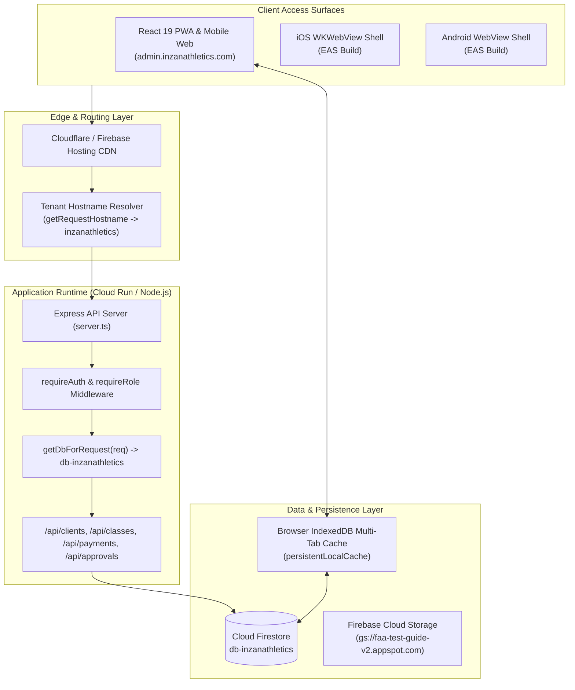
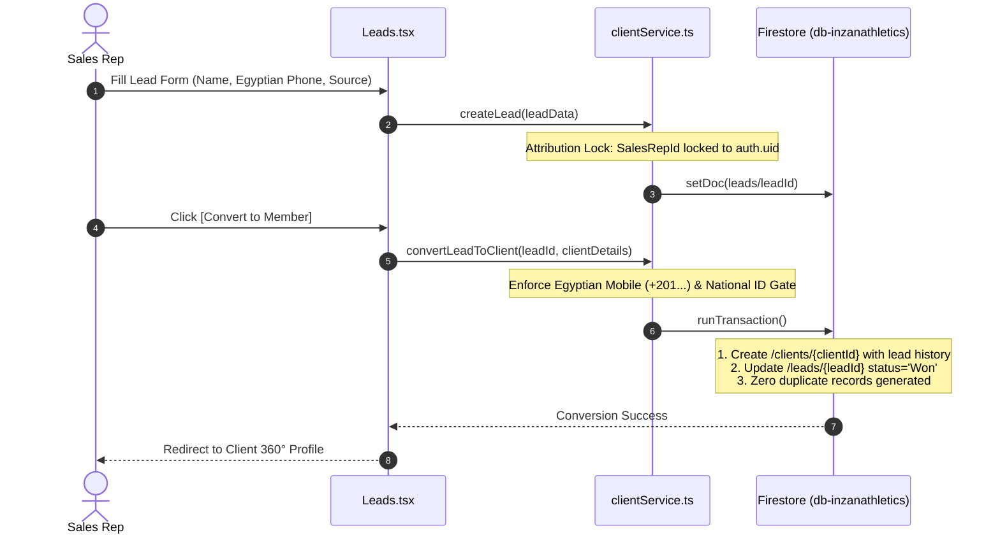
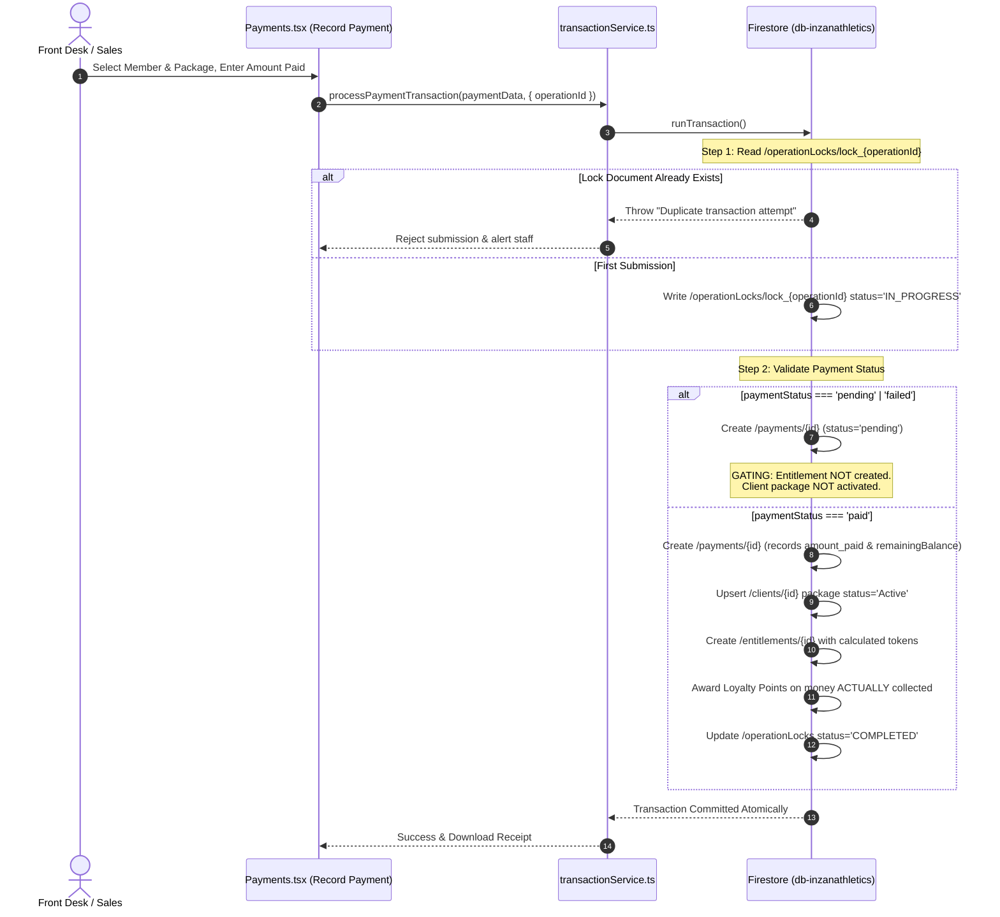
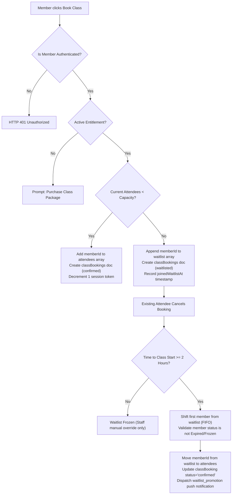
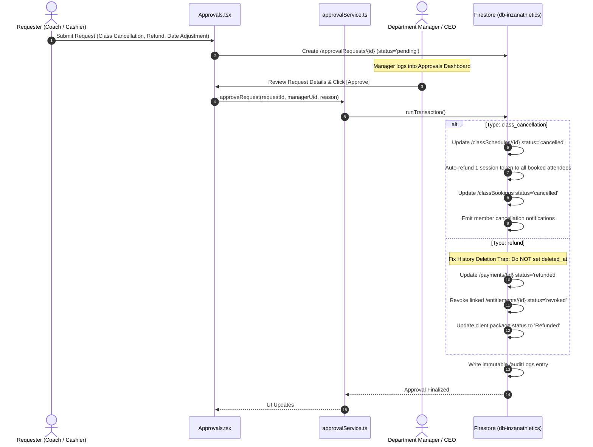
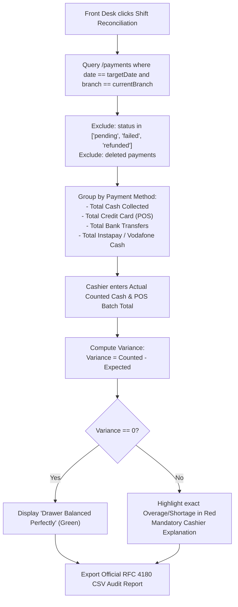

# INZAN ATHLETICS — Technical Architecture, Data Specification & Operations Manual

**Platform:** MitrixoGYM CRM Platform (Inzan Athletics Tenant Edition)  
**Tenant Configuration:** `faa-test-guide-v2` / `db-inzanathletics`  
**Target Environments:** Cloud Run API, Firebase Hosting (`admin.inzanathletics.com`), PWA / Native Shell  
**Specification Baseline:** `INZAN Integrated System [2].pdf` (All 34 Sections & 15 Acceptance Criteria)  
**Publication Version:** v2.0-Production  

---

## 1. System Architecture & Multi-Tenant Isolation

### 1.1 High-Level Architecture Topology

The platform is designed around a zero-trust, multi-tenant cloud architecture. Inzan Athletics runs on the central Firebase project `faa-test-guide-v2` utilizing the named database instance `db-inzanathletics`, strictly segregated from other tenants (such as Strike's dedicated `strike-production-f5242` environment).



### 1.2 Tenant Resolution & Request Scoping
All server-side queries resolve the target database dynamically from the incoming request hostname:

1. `getRequestHostname(req)` extracts `req.headers['x-forwarded-host'] || req.hostname`.
2. `getTenantInfoForHost(hostname)` resolves the tenant configuration:
   - `admin.inzanathletics.com` $\to$ Tenant ID: `inzanathletics`, Project: `faa-test-guide-v2`, Database: `db-inzanathletics`.
3. `getDbForRequest(req)` calls `getFirestore(firebaseApp, 'db-inzanathletics')`.
4. **Invariant:** No direct database reference is ever shared across requests; hardcoded project references are strictly prohibited in data paths.

---

## 2. Complete Firestore Data Model & Schema Dictionary

The system uses 16 core Firestore collections in `db-inzanathletics`. Below is the complete schema dictionary.

### 2.1 Collection: `clients` (Master Member Records)
Path: `/clients/{clientId}`

| Field Name | Type | Description |
|---|---|---|
| `id` | `string` | Unique Firestore document ID (`client_...` or auto-id). |
| `memberId` | `string` | Human-readable sequential ID (e.g. `INZ-01042`). Primary foreign key for entitlements and bookings. |
| `name` | `string` | Full name of the member. |
| `phone` | `string` | Normalized Egyptian mobile number (`+201XXXXXXXXX`). |
| `nationalId` | `string` | National ID / Passport number (mandatory per §8 pre-payment gate). |
| `email` | `string?` | Email address for notifications and account recovery. |
| `portalUserId` | `string?` | Firebase Auth UID linking client to their mobile app login. |
| `status` | `'Active' \| 'Expired' \| 'Frozen' \| 'Suspended'` | Overall membership status. |
| `package` | `string` | Display name of the primary active package. |
| `packageId` | `string` | Foreign key referencing `/packages/{packageId}`. |
| `startDate` | `string` | ISO 8601 date string (`YYYY-MM-DD`). |
| `endDate` | `string` | Expiration date (`YYYY-MM-DD`). Expired members cannot book. |
| `sessionsRemaining` | `number \| 'unlimited'` | Current remaining balance of PT sessions. |
| `usedSessions` | `number` | Total number of PT sessions completed/deducted. |
| `freezeUntil` | `string?` | ISO date if the membership package is currently frozen. |
| `pointsBalance` | `number` | Loyalty points balance awarded on collected cash. |
| `salesRepId` | `string?` | UID of the sales representative who closed the membership. |
| `leadSource` | `string` | Lead acquisition channel (e.g. `Walk-in`, `Social Media`). |
| `createdAt` | `string` | ISO 8601 timestamp. |
| `updatedAt` | `string` | ISO 8601 timestamp. |

### 2.2 Collection: `packages` (Product Catalogue)
Path: `/packages/{packageId}`

| Field Name | Type | Description |
|---|---|---|
| `id` | `string` | Unique document ID. |
| `name` | `string` | Product name (e.g. `12 Sessions Personal Training`). |
| `category` | `'Gym Memberships' \| 'Personal Training (PT)' \| 'Drop-in / Day Pass' \| 'Classes'` | Segmentation category. |
| `type` | `'Private' \| 'Group' \| 'Other'` | PT session type for hourly capacity bounding. |
| `price` | `number` | Standard retail price in Egyptian Pounds (EGP). |
| `sessions` | `number \| 'unlimited'` | Number of included session credits. |
| `validityDays` | `number` | Package lifespan from activation (e.g. 30, 90, 365). |
| `freezeLimitDays` | `number` | Maximum allowable freeze duration (default 7 days for PT). |
| `isActive` | `boolean` | `true` if available for sale; `false` if archived. |
| `archivedAt` | `string?` | Timestamp of archival (soft-archive preservation). |
| `archivedBy` | `string?` | Staff UID who archived the package. |
| `archivedReason` | `string?` | Audit reason for deprecating the product. |

### 2.3 Collection: `payments` (Financial Transactions)
Path: `/payments/{paymentId}`

| Field Name | Type | Description |
|---|---|---|
| `id` | `string` | Unique transaction ID. |
| `operationId` | `string` | Idempotency key (UUIDv4) preventing duplicate submits. |
| `clientId` | `string` | Document ID of the member. |
| `clientName` | `string` | Member display name. |
| `packageId` | `string` | Purchased product ID. |
| `packageName` | `string` | Product name. |
| `amount` | `number` | Net payable amount after discounts. |
| `amount_paid` | `number` | Actual cash/funds collected at checkout. |
| `originalAmount` | `number` | Catalog price before discount or credit. |
| `discount` | `number` | Discount value applied. |
| `discountType` | `'percentage' \| 'fixed' \| 'none'` | Discount calculation rule. |
| `remainingBalance` | `number` | Outstanding balance if partial payment was recorded. |
| `isPartialPayment` | `boolean` | `true` if `remainingBalance > 0`. |
| `isComplimentary` | `boolean` | `true` for 100% free/promotional packages (0 points). |
| `method` | `'Cash' \| 'Credit Card' \| 'Bank Transfer' \| 'Instapay' \| 'Vodafone Cash'` | Payment channel. |
| `paymentStatus` | `'paid' \| 'pending' \| 'failed' \| 'refunded'` | Financial settlement status. |
| `receiptNumber` | `string` | Sequential receipt reference. |
| `processedBy` | `string` | Staff UID who recorded the payment. |
| `date` | `string` | Payment date (`YYYY-MM-DD`). |
| `timestamp` | `string` | Full ISO 8601 transaction timestamp. |

### 2.4 Collection: `entitlements` (Service Rights)
Path: `/entitlements/{entitlementId}`

| Field Name | Type | Description |
|---|---|---|
| `id` | `string` | Unique entitlement record ID. |
| `memberId` | `string` | Sequential member ID (`INZ-XXXXX`) or Client ID. |
| `packageId` | `string` | Associated package foreign key. |
| `serviceType` | `'pt' \| 'class' \| 'gym_access' \| 'nutrition'` | Entitled service type. |
| `balance` | `number` | Current remaining booking tokens. |
| `totalGranted` | `number` | Original session allocation at purchase. |
| `startDate` | `string` | Validity start (`YYYY-MM-DD`). |
| `endDate` | `string` | Expiration date (`YYYY-MM-DD`). |
| `status` | `'active' \| 'expired' \| 'revoked' \| 'frozen'` | Booking eligibility flag. |
| `paymentId` | `string` | Linked transaction ID. |
| `createdAt` | `string` | ISO timestamp. |

### 2.5 Collection: `sessions` (Private PT Sessions)
Path: `/sessions/{sessionId}`

| Field Name | Type | Description |
|---|---|---|
| `id` | `string` | Unique session reservation ID. |
| `coachId` | `string` | UID of the trainer. |
| `coachName` | `string` | Trainer display name. |
| `clientId` | `string` | Member ID. |
| `clientName` | `string` | Member name. |
| `date` | `string` | Session date (`YYYY-MM-DD`). |
| `startTime` | `string` | Start time string (e.g. `14:00`). |
| `endTime` | `string` | End time string (e.g. `15:00`). |
| `sessionType` | `'1-on-1' \| 'Partner' \| 'Small Group'` | Capacity bracket (1, 2, or 3-5 clients). |
| `status` | `'Scheduled' \| 'Attended' \| 'No Show' \| 'Rescheduled' \| 'Cancelled'` | Operational state. |
| `tokenDeducted` | `number` | Tokens decremented (1 for Attended/No Show/Late Cancel). |
| `rating` | `number?` | Member review rating (1 to 5 stars). |
| `comment` | `string?` | Member feedback commentary. |
| `cancellationReason` | `string?` | Reason if cancelled or rescheduled. |
| `cancelledAt` | `string?` | Timestamp of cancellation. |

### 2.6 Collection: `classSchedules` & `classBookings`
Paths: `/classSchedules/{scheduleId}` and `/classBookings/{bookingId}`

- **`classSchedules`**:
  - `id`: Unique schedule ID.
  - `name`: Class name (e.g. *Boxing Fundamentals*).
  - `instructorId` / `instructorName`: Assigned instructor.
  - `date`: Class date (`YYYY-MM-DD`).
  - `startTime` / `endTime`: Time window.
  - `capacity`: Maximum allowed in-studio participants.
  - `attendees`: Array of member IDs currently confirmed.
  - `waitlist`: Array of member IDs queued (FIFO order).
  - `isFree`: `boolean` (free for all members or paid drop-in).
  - `status`: `'active' \| 'cancelled' \| 'completed'`.
- **`classBookings`**:
  - `id`: Document ID.
  - `scheduleId`: Schedule reference.
  - `memberId`: Member reference.
  - `status`: `'confirmed' \| 'waitlisted' \| 'attended' \| 'no_show' \| 'cancelled'`.
  - `joinedWaitlistAt`: Timestamp used for strict FIFO sorting.

### 2.7 Collection: `operationLocks` (Deterministic OCC Locks)
Path: `/operationLocks/{lockId}`

| Field Name | Type | Description |
|---|---|---|
| `id` | `string` | Set to `lock_{operationId}`. |
| `operationId` | `string` | UUID generated on form mount. |
| `lockedBy` | `string` | UID of authenticated actor. |
| `status` | `'IN_PROGRESS' \| 'COMPLETED'` | Transaction state. |
| `createdAt` | `string` | ISO timestamp used for automatic expiration. |

---

## 3. Core Operational Flows & Engineering Execution

### Flow 1: Lead Capture to 360° Member Conversion (PRD §8)



**Step-by-Step Operator Action:**
1. Navigate to **Leads** and click **New Lead**.
2. Select Lead Source (`Walk-in`, `Social Media`, `Referral`, `Corporate`).
3. Fill mandatory contact fields. The sales rep's identity is stamped permanently.
4. When the lead agrees to sign up, click **Convert to Member** on the lead card.
5. Provide National ID / Passport. The system creates the master member record while archiving the lead as `Won`.

---

### Flow 2: Atomic Checkout & Entitlement Locking (PRD §12, §17, §20, §26)



**Step-by-Step Operator Action:**
1. Open **Payments** > **Record Payment**.
2. Select member and choose package.
3. Validate price calculations:
   - For full payment: Enter amount equal to net price.
   - For partial payment: Enter amount actually collected. The system automatically stores `remainingBalance` and flags `isPartialPayment = true`.
4. Click **Complete Payment**.
5. If staff accidentally double-clicks, the second click receives an immediate `Duplicate transaction rejected` error via the OCC lock document without double-charging.

---

### Flow 3: Class Booking, Capacity & FIFO Waitlist Auto-Promotion (PRD §10, §14)



**Step-by-Step Operator Action:**
1. **Member:** Opens **Classes** in Member App, finds class, clicks **Book**.
   - If available: Instant confirmation.
   - If full: Clicks **Join Waitlist**.
2. **Cancellation & Auto-Promotion:**
   - When any confirmed attendee cancels up to 2 hours before start time, Cloud Function `waitlist.ts` automatically pops the first member in the FIFO queue, confirms their seat, and sends a push notification.
3. **10-Minute No-Show Automated Sweep:**
   - Exactly 10 minutes past class start time, `noShowJob.ts` inspects unverified attendees, flags them as `no_show`, logs a strike, and imposes a 7-day booking suspension upon the 3rd strike.

---

### Flow 4: Personal Training Lifecycle & Token Deduction Matrix (PRD §9)

#### PT Token Deduction Truth Matrix

| Transition State | Action | Token Deducted | Client Balance Effect |
|---|---|:---:|---|
| `Scheduled` $\to$ `Attended` | Coach confirms completion | **-1** | Decrements `sessionsRemaining` by 1; increments `usedSessions`. |
| `Scheduled` $\to$ `No Show` | Client missed session | **-1** | Decrements `sessionsRemaining` by 1. |
| `Scheduled` $\to$ `Rescheduled` | Session moved to new date | **0** | No deduction; balance preserved. |
| Cancellation $> 12\text{ hours}$ | Advance cancellation | **0** | No deduction; slot freed. |
| Cancellation $< 12\text{ hours}$ | Late cancellation | **-1** | Forfeits 1 session token. |
| Unlimited Package | Attended / No Show | **0** | `sessionsRemaining` unchanged; increments `usedSessions`. |

**Step-by-Step Operator Action:**
1. **Coach Scheduling:** Coach opens **Personal Training**, clicks **Availability**, and sets weekly working hours.
2. **Capacity Setup:** Set hourly capacity:
   - 1-on-1: Max 1 client per hour.
   - Partner: Max 2 clients per hour.
   - Small Group: Min 3, Max 5 clients per hour.
3. **Marking Attendance:** Open session card $\to$ select status from dropdown (`Attended`, `No Show`, `Rescheduled`). The system executes token adjustments instantly.

---

### Flow 5: Nutrition Booking with Collision-Free Locks (PRD §6.5, §11)

To prevent simultaneous double-booking of a nutritionist:
1. Every slot reservation generates a deterministic string key:
   $$\text{CollisionKey} = \text{nutritionistId} + \text{"\_"} + \text{date} + \text{"\_"} + \text{timeBucket}$$
2. The booking engine performs a transactional check against existing appointments matching this composite key.
3. Schedule boundary validation ensures bookings only occur during working hours and never in the past.
4. **Confidential Consultation Notes:** Stored in `/nutritionNotes/{noteId}`. `firestore-tenant.rules` enforces that only the nutritionist who authored the note and the CEO can view or edit consultation details.

---

### Flow 6: Maker-Checker Approval Workflows (PRD §20)



**Step-by-Step Operator Action:**
1. **Coach:** If unable to teach a class, opens class details $\to$ clicks **Request Cancellation** $\to$ enters reason.
2. **Manager:** Receives notification $\to$ opens **Approvals** screen $\to$ reviews impact (e.g. 14 members booked).
3. **Approval Execution:** Manager clicks **Approve**. The system cancels the schedule, credits 1 session back to all 14 members, and sends in-app push alerts automatically.

---

### Flow 7: End-of-Shift Reconciliation & Drawer Balancing (PRD §7, §17, §19)

**Mathematical Invariant:**
$$\text{Expected Drawer Cash} = \text{Opening Float} + \sum \text{Cash Payments} - \sum \text{Cash Refunds}$$
$$\text{Variance} = \text{Actual Counted Cash} - \text{Expected Drawer Cash}$$



**Step-by-Step Operator Action:**
1. Open **Front Desk** > **Shift Reconciliation** (or **Reports**).
2. Review automated breakdown of collections across payment methods.
3. Physically count cash in register $\to$ enter amount into **Actual Counted Cash**.
4. Enter POS terminal settlement totals.
5. If variance exists, enter explanation notes.
6. Click **Download CSV Report** to generate the permanent reconciliation file for accounting.

---

### Flow 8: Recurring Tasks & Staff Performance KPIs (PRD §18.2)

1. **Daily Template Engine:** Active recurring templates (`OPENING_CHECKLIST`, `EQUIPMENT_INSPECTION`, `CASH_COUNT`, `CLOSING_CHECKLIST`) generate daily operational tasks.
2. **Idempotency Guarantee:** The generator evaluates existing tasks for the day; re-running produces 0 duplicates.
3. **Timeliness Evaluation:**
   - Completed at or before deadline $\to$ `COMPLETED_ON_TIME`.
   - Completed after deadline $\to$ `COMPLETED_OVERDUE`.
4. **Staff KPIs:** Calculates $\text{Completion Rate} = \frac{\text{Completed Tasks}}{\text{Total Assigned}}$ and $\text{On-Time Rate} = \frac{\text{Completed On-Time}}{\text{Total Completed}}$.

---

### Flow 9: Straight-Line Equipment Depreciation & Service Due Engine (PRD §24)

$$\text{Depreciable Base} = \max(0, \text{Purchase Price} - \text{Salvage Value})$$
$$\text{Annual Depreciation} = \frac{\text{Depreciable Base}}{\text{Useful Life in Years}}$$
$$\text{Years Elapsed} = \frac{\text{Current Date} - \text{Purchase Date}}{365.25 \times 24 \times 3600 \times 1000}$$
$$\text{Current Book Value} = \max(\text{Salvage Value}, \text{Purchase Price} - (\text{Annual Depreciation} \times \text{Years Elapsed}))$$

- **Service Status:** If $\text{nextServiceDueDate} \le \text{today}$, status transitions automatically to `MAINTENANCE_DUE`. Equipment marked `UNDER_REPAIR` or `DECOMMISSIONED` preserves its state until manually cleared by facility staff.

---

## 4. Security & Role-Based Access Control (RBAC) Specifications

### 4.1 RBAC Matrix by Module

| Module / Resource | CEO / Super Admin | Dept Manager | Front Desk | Sales Rep | Coach | Nutritionist | Member |
|---|:---:|:---:|:---:|:---:|:---:|:---:|:---:|
| **Member Master Record** | Full CRUD | Full (Dept) | Create / Read | Create / Read | Assigned Only | Assigned Only | Own Only |
| **Payments & Transactions** | Full + Delete | Read / Refund | Create / Read | Create Only | No Access | No Access | Own Receipts |
| **Entitlements** | Full Adjust | Manage | Read Only | Read Only | Read Only | Read Only | Own Balance |
| **PT Schedules & Slots** | Full Control | Full Control | Full Read | Read Only | Own Slots | No Access | Book Own |
| **Classes & Rosters** | Full Control | Full Control | Check-in | Read Only | Assigned Only | No Access | Book Own |
| **Nutrition Notes** | Full Read | No Access | No Access | No Access | No Access | Author Only | Approved View |
| **Lead Pipeline** | Full Access | Full Access | Limited View | Own Leads | No Access | No Access | No Access |
| **Approvals Queue** | Final Approve | Dept Approve | Request Only | Request Only | Request Only | Request Only | No Access |
| **Audit Logs** | Full Read | Dept View | No Access | No Access | No Access | No Access | No Access |
| **System Settings** | Full Edit | No Access | No Access | No Access | No Access | No Access | No Access |

### 4.2 Security Rules Implementation Highlights (`firestore-tenant.rules`)
- **Self-Isolation:** Members querying `/clients` or `/classBookings` can strictly only fetch records where `portalUserId == request.auth.uid`.
- **Append-Only Audit Trail:** In `/auditLogs/{logId}`, `allow create: if isAuthenticated();` is permitted, while `allow update, delete: if false;` prevents tampering by any user.
- **Nutrition Privacy:** In `/nutritionNotes/{noteId}`, read access requires `isCEO() || request.auth.uid == resource.data.nutritionistId`.

---

## 5. Verification, Diagnostic Scripts & Maintenance Runbooks

### 5.1 Automated Test Execution Commands
The platform includes 10 dedicated test suites verifying all critical logic:

```bash
# Execute individual suites
npm run test:pricing         # Validates discount math, upgrades, and gross/net calculations
npm run test:calendar        # Validates RFC 5545 ICS generation and Google Calendar deep links
npm run test:shift           # Validates drawer cash, card settlements, and CSV reconciliation
npm run test:nutrition       # Validates collision keys, schedule bounds, and slot validation
npm run test:pt              # Validates token deduction matrix (Attended, No Show, Rescheduled)
npm run test:transactions    # Validates OCC locks, partial payments, idempotency, and rollbacks
npm run test:notifications   # Validates notification templates, delivery logging, and deduplication
npm run test:inventory       # Validates stock movements, threshold calculations, and oversell defense
npm run test:tasks           # Validates recurring task templates, deadline compliance, and staff KPIs
npm run test:equipment       # Validates GAAP straight-line depreciation and maintenance due alerts

# Execute complete quality verification gate
npm run lint                 # Typecheck passes with 0 errors (tsc --noEmit)
npm run build                # Full frontend & backend production bundling
```

### 5.2 Read-Only Diagnostic Scripts
To detect orphan packages without entitlements across any tenant database:
```bash
node scripts/audit_entitlement_gaps.cjs
```
*Note: This script performs read operations only and will never alter production data.*

### 5.3 Live Rules Deployment
To deploy updated Firestore security rules to Inzan Athletics:
```bash
npx firebase deploy --only firestore:rules --project faa-test-guide-v2
```
