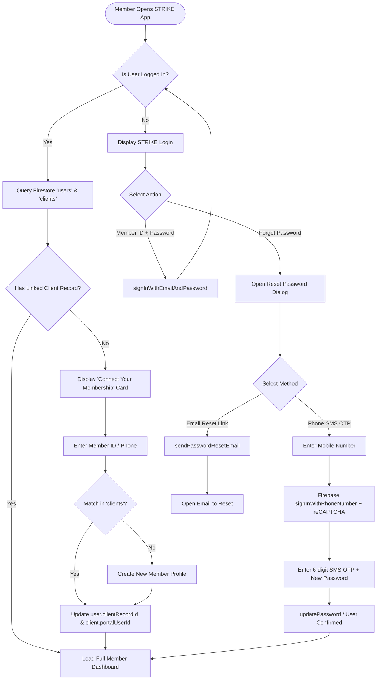
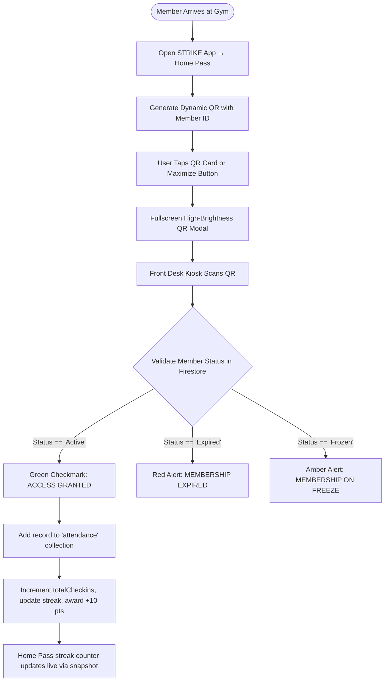
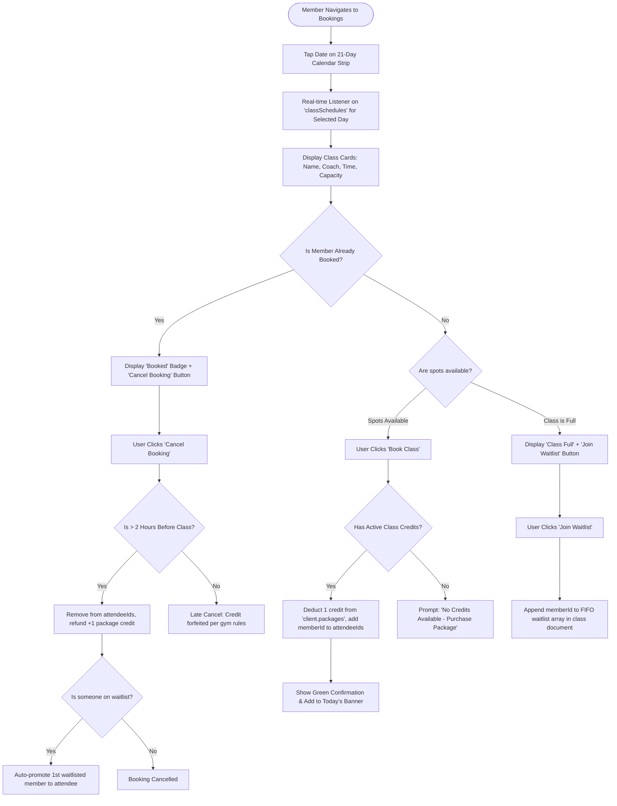
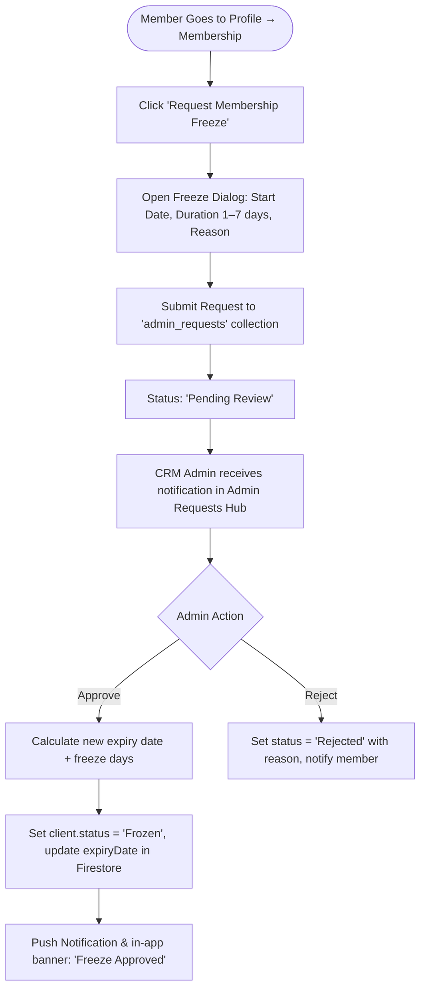
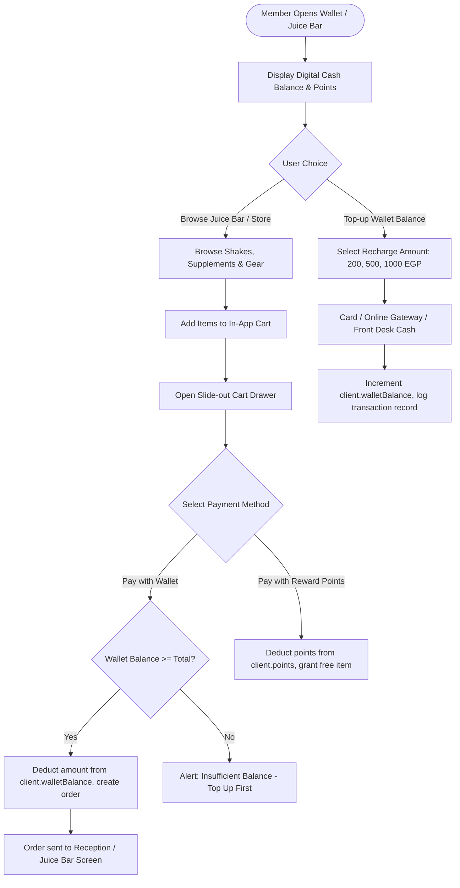
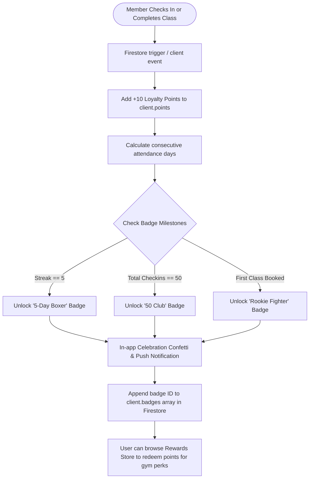

# 🥊 STRIKE Mobile App: Complete Architecture, Flowcharts & Button Verification Guide

---

## 📑 Table of Contents
1. [App Architecture & Navigation Hierarchy](#1-app-architecture--navigation-hierarchy)
2. [End-to-End System Logic Flowcharts (Mermaid)](#2-end-to-end-system-logic-flowcharts)
   - [2.1 Authentication & Entry Flow](#21-authentication--entry-flow)
   - [2.2 Digital QR Pass & Kiosk Check-In Flow](#22-digital-qr-pass--kiosk-check-in-flow)
   - [2.3 Class & PT Booking / Waitlist Flow](#23-class--pt-booking--waitlist-flow)
   - [2.4 Membership Freeze & Admin Approval Flow](#24-membership-freeze--admin-approval-flow)
   - [2.5 Wallet, Store & Juice Bar Flow](#25-wallet-store--juice-bar-flow)
   - [2.6 Gamification, Badges & Rewards Flow](#26-gamification-badges--rewards-flow)
3. [Exhaustive Button-by-Button Action & Verification Directory](#3-button-by-button-verification-directory)
   - [Top Header Actions](#top-header-actions)
   - [Tab 1: Home Pass Screen (`home`)](#tab-1-home-pass-screen)
   - [Tab 2: Bookings Screen (`booking`)](#tab-2-bookings-screen)
   - [Tab 3: Wallet Screen (`wallet`)](#tab-3-wallet-screen)
   - [Tab 4: Guest Invites Screen (`invites`)](#tab-4-guest-invites-screen)
   - [Tab 5: Profile & Settings Screen (`profile`)](#tab-5-profile--settings-screen)
4. [Firestore Data Models & State Synchronization](#4-firestore-data-models--state-synchronization)

---

## 1. App Architecture & Navigation Hierarchy

```
                    ┌────────────────────────────────────────┐
                    │      STRIKE Mobile App (PWA / App)     │
                    └───────────────────┬────────────────────┘
                                        │
                         [Authentication Gate]
                                        │
           ┌────────────────────────────┴────────────────────────────┐
           │                                                         │
   [Unauthenticated]                                           [Authenticated]
   - Member Login (ID/Phone + Pass)                                  │
   - Coach Login (Email + Pass)                                      ▼
   - Staff Login (Email + Pass)                             ┌─────────────────┐
   - Forgot Password (Phone SMS / Email)                    │  MemberPortal   │
   - Instant Self-Link / Guest Setup                        └────────┬────────┘
                                                                     │
            ┌──────────────────────┬──────────────────────┬──────────┴───────────┬──────────────────────┐
            ▼                      ▼                      ▼                      ▼                      ▼
    ┌───────────────┐      ┌───────────────┐      ┌───────────────┐      ┌───────────────┐      ┌───────────────┐
    │ 1. Home Pass  │      │ 2. Bookings   │      │ 3. Wallet     │      │ 4. Invites    │      │ 5. Profile    │
    │  (MemberHome) │      │(MemberClasses)│      │(MemberWallet) │      │(MemberInvites)│      │(MemberProfile)│
    └───────────────┘      └───────────────┘      └───────────────┘      └───────────────┘      └───────────────┘
     • Dynamic QR Pass      • Group Classes        • Cash Balance         • Free Guest Passes    • Membership & Freeze
     • Fullscreen QR        • PT Sessions          • Top-up Balance       • WhatsApp Invite      • Check-in History
     • Quick Shortcuts      • Date Strip Picker    • Transaction History  • Claim Tracking       • Body Tracker & Stats
     • Streak & Stats       • Book / Cancel / Wait • Store Purchases      • Guest QR Code        • Badges & Level
     • Today's Classes      • Roster Status                                                      • Reward Redemption
     • Announcements                                                                             • Account Settings
```

---

## 2. End-to-End System Logic Flowcharts

### 2.1 Authentication & Entry Flow



---

### 2.2 Digital QR Pass & Kiosk Check-In Flow



---

### 2.3 Class & PT Booking / Waitlist Flow



---

### 2.4 Membership Freeze & Admin Approval Flow



---

### 2.5 Wallet, Store & Juice Bar Flow



---

### 2.6 Gamification, Badges & Rewards Flow



---

## 3. Button-by-Button Verification Directory

### Top Header Actions

| UI Element | Location | Trigger / User Action | What Happens Under the Hood | Expected Screen Result |
| :--- | :--- | :--- | :--- | :--- |
| **Gym Logo / Title** | Top Left | Click | Refreshes active client data | Smooth bounce animation, confirms active gym branding |
| **Role Badge ("Member")** | Top Left | Display only | Shows authenticated portal tier | Outlined pill badge in brand accent color |
| **Profile Switcher Dropdown** | Top Center | Click (if family accounts linked) | Switches `selectedClientId` to linked family member | Instantly swaps QR code, bookings, and wallet to family member |
| **Notification Bell** | Top Right | Click | Opens slide-out `MemberNotificationBell` sheet | Displays unread announcements, booking confirmations, and freeze alerts |
| **Theme Toggle (Sun/Moon)** | Top Right | Click | Calls `toggleTheme()` in `ThemeContext` | Smooth transition between Dark mode and Light mode |
| **Logout Button** | Top Right | Click | Calls `auth.signOut()` | Clears auth state and returns to STRIKE Login screen |

---

### Tab 1: Home Pass Screen (`home`)

| Button / UI Control | Location | Action | Backend & Firestore Operations | Verification Checklist |
| :--- | :--- | :--- | :--- | :--- |
| **QR Pass Card** | Hero Center | Click card | Opens `Fullscreen QR Dialog` with max brightness | QR code enlarges to full viewport for rapid kiosk scanning |
| **Maximize / Minimize Icon** | Top right of QR card | Click | Toggles fullscreen QR dialog | Expands/collapses QR pass modal smoothly |
| **Quick Button: "Bookings"** | Shortcuts Grid | Click | Calls `onNavigate('booking')` | Switches active bottom tab to `Bookings` screen |
| **Quick Button: "Wallet"** | Shortcuts Grid | Click | Calls `onNavigate('wallet')` | Switches active bottom tab to `Wallet` screen |
| **Quick Button: "Progress"** | Shortcuts Grid | Click | Calls `onNavigate('profile-progress')` | Switches to `Profile` tab with `Progress` sub-tab open |
| **Quick Button: "Profile"** | Shortcuts Grid | Click | Calls `onNavigate('profile')` | Switches to `Profile` tab with `Settings` sub-tab open |
| **Announcements Carousel** | Below Shortcuts | Swipe / Arrows | Cycles through active gym announcements | Smooth horizontal transition between promo cards |
| **Today's Upcoming Class Card** | Bottom of Home | Click | Focuses class details and studio location | Shows coach photo, time, and studio countdown |

---

### Tab 2: Bookings Screen (`booking`)

| Button / UI Control | Location | Action | Backend & Firestore Operations | Verification Checklist |
| :--- | :--- | :--- | :--- | :--- |
| **Calendar Date Strip Buttons** | Top Horizontal Bar | Click any day (-7 to +14 days) | Sets `selectedDate`, filters `classSchedules` in memory | Highlights chosen date with brand accent, updates class list |
| **"Book Class" Button** | Class Card (Open Spot) | Click | Deducts 1 credit from `client.packages`, adds `client.id` to `attendeeIds` | Button turns green with checkmark: "Booked" |
| **"Cancel Booking" Button** | Class Card (Booked) | Click | Removes `client.id` from `attendeeIds`, restores credit, promotes waitlist | Confirmation modal appears, on confirm returns spot to pool |
| **"Join Waitlist" Button** | Class Card (Full Spot) | Click | Appends `client.id` to `waitlist` array on class doc | Button turns amber: "On Waitlist (#1 in line)" |
| **PT vs Classes Toggle** | Top Segmented Tab | Click | Switches between `Group Classes` and `PT 1-on-1` | Toggles schedule view without page reload |

---

### Tab 3: Wallet Screen (`wallet`)

| Button / UI Control | Location | Action | Backend & Firestore Operations | Verification Checklist |
| :--- | :--- | :--- | :--- | :--- |
| **"Top Up Balance" Button** | Wallet Balance Card | Click | Opens recharge amount selector modal | Prompts user to pick 200, 500, or 1000 EGP top-up |
| **"Transaction History" Filter** | History Section | Click tabs (All, Spent, Added) | Filters in-memory transaction logs | Displays dates, amounts, and receipt items |
| **"Redeem Points" Button** | Points Card | Click | Navigates to Rewards Store | Shows items redeemable with current loyalty points |

---

### Tab 4: Guest Invites Screen (`invites`)

| Button / UI Control | Location | Action | Backend & Firestore Operations | Verification Checklist |
| :--- | :--- | :--- | :--- | :--- |
| **"Generate Guest Pass" Button** | Hero Section | Click | Creates unique invite token in `invites` collection | Generates dedicated shareable link & guest QR pass |
| **"Share to WhatsApp" Button** | Invite Card | Click | Opens WhatsApp with pre-filled invitation text | Recipient opens link to claim their 1-day free gym pass |
| **"Copy Link" Button** | Invite Card | Click | Copies `https://strike.mitrixo.com/guest?invite=...` | Toast alert: "Invite link copied to clipboard!" |

---

### Tab 5: Profile & Settings Screen (`profile`)

| Sub-Tab | Button / Control | Action & Operations | Verification Result |
| :--- | :--- | :--- | :--- |
| **Settings** | **"Save Changes"** | Updates `name`, `phone`, `emergencyContact` in Firestore `clients` & `users` | Toast: "Profile details updated successfully" |
| **Settings** | **"Change Password"** | Triggers Firebase Auth password update or sends reset email | Validates min 6 chars, confirms update |
| **Membership** | **"Request Freeze"** | Opens Freeze Modal (1–7 days) $\rightarrow$ writes to `admin_requests` | Shows "Freeze Request Pending Admin Approval" |
| **History** | **Check-in Cards** | Displays paginated logs from `attendance` collection | Shows timestamp, studio, and class name |
| **Progress** | **"Log Weight / Measurements"** | Adds entry to `body_logs` collection with date and values | Updates progress charts and body fat trendline |
| **Badges** | **Badge Icons** | Click any badge to view unlock criteria & progress | Shows locked vs unlocked state with achievement date |
| **Rewards** | **"Claim Reward"** | Deducts loyalty points, creates store voucher code | Displays QR voucher for free shake or merchandise |

---

## 4. Firestore Data Models & State Synchronization

| Collection | Key Document Fields | Sync Behavior |
| :--- | :--- | :--- |
| `clients` | `name`, `phone`, `memberId`, `status`, `packages[]`, `walletBalance`, `points`, `badges[]` | Real-time `onSnapshot` listener attached in `MemberPortal` |
| `classSchedules` | `name`, `coachName`, `date`, `startTime`, `capacity`, `attendeeIds[]`, `waitlist[]` | Filtered real-time listener by active tenant & selected date |
| `attendance` | `clientId`, `date`, `checkInTime`, `classId`, `status` | Query on mount, cached with local storage fallback |
| `admin_requests` | `type: 'freeze'`, `clientId`, `startDate`, `days`, `status: 'pending'` | Real-time listener for freeze status badge |
| `invites` | `senderClientId`, `guestName`, `token`, `status: 'active' \| 'used'` | Real-time listener in `MemberInvites` |

---
*Generated for STRIKE Boxing Gym Platform Verification & QA.*
