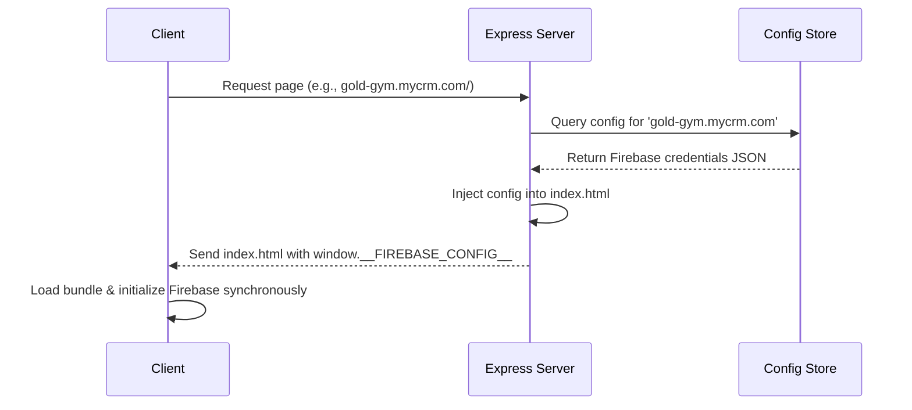

# Implementation Plan: Dynamic Tenant Configurations (Option 1)

This plan details how we will refactor the cloned workspace (`MitrixoGYMCRMPlatform`) to support dynamic multi-instance database connections. The goal is to allow one single build to serve multiple gyms by injecting the correct database credentials based on the hostname.

---

## Proposed Changes

We will modify the backend hosting server to inject the configuration dynamically at request time, and update the frontend code to read this configuration synchronously on load.

---

### Component: Backend Hosting Server

We will update the Express server to intercept index.html requests, identify the gym hostname, fetch their credentials, and inject them directly into the HTML payload.

#### [MODIFY] [server.ts](file:///C:/Users/Mi5a/MitrixoGYMCRMPlatform/server.ts)
- Update static route handlers to read `index.html` dynamically rather than serving it as a static file.
- Implement a lookup helper mapping hostnames (e.g. `localhost`, `mitrixogymcrm-boxing.local`, `another-gym.crm.com`) to their respective Firebase configs.
- Inject a script tag: `` prior to returning the HTML.

---

### Component: Frontend Initialization

We will modify how the frontend reads the Firebase config at start-up.

#### [MODIFY] [index.html](file:///C:/Users/Mi5a/MitrixoGYMCRMPlatform/index.html)
- Add a placeholder comment `<!-- FIREBASE_CONFIG_PLACEHOLDER -->` inside the `<head>` element.

#### [MODIFY] [src/firebase.ts](file:///C:/Users/Mi5a/MitrixoGYMCRMPlatform/src/firebase.ts)
- Modify the initialization logic to check if `window.__FIREBASE_CONFIG__` is populated.
- If it exists, initialize Firebase with the dynamic tenant config.
- Fallback to the local `firebase-applet-config.json` for backward compatibility and local development.

---

## Verification Plan

### Automated Tests
- Run compiler check: `npm run lint` in the `MitrixoGYMCRMPlatform` folder.
- Execute build step: `npm run build` in the `MitrixoGYMCRMPlatform` folder to guarantee compilation compatibility.

### Manual Verification
- Launch the Express server in production mode using different hostname headers (e.g., simulating `localhost` vs a custom tenant host) and inspect the returned HTML to ensure correct configuration injection.
