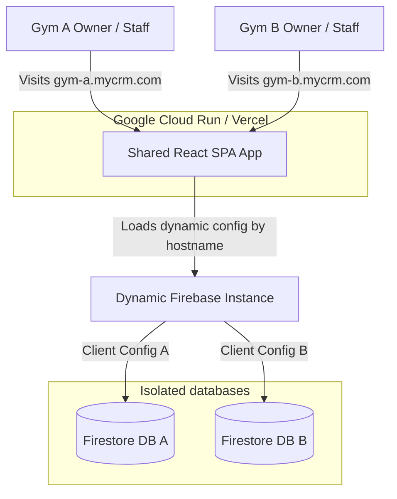
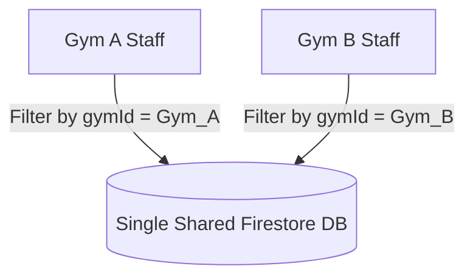
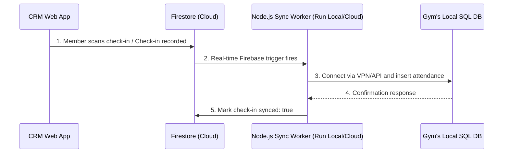
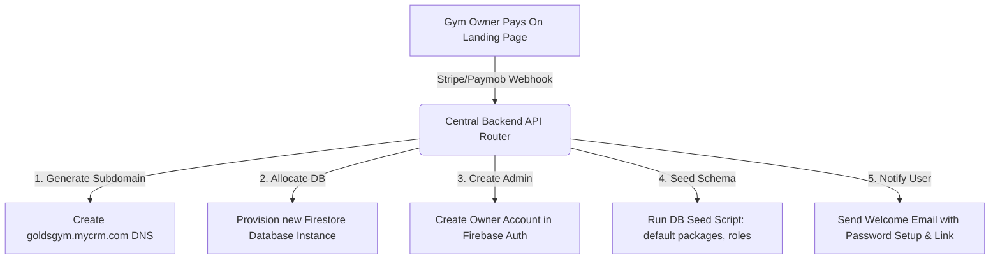

# CRM Replication & Multi-Gym Onboarding Blueprint

This blueprint outlines the complete plan, architecture options, database integration strategies, and automated onboarding flow for transforming your current CRM into a multi-tenant platform serving multiple gyms.

---

## 1. Architectural Strategy: Multi-Instance vs. Shared Multi-Tenant

To support multiple gym clients, we must decide how to partition the data and frontends. Based on your current codebase (which connects directly to Firestore via client-side hooks), here are the two options:

### Option A: Multi-Instance (Isolated Projects & Dynamic Config) — *[RECOMMENDED]*
Each gym gets its own isolated Firestore database. The React codebase remains **identical**, but fetches the correct Firebase configuration dynamically at runtime.



*   **How it Works**: You deploy a **single web app bundle** (on Vercel, Netlify, or GCP Cloud Run). Instead of hardcoding `firebase-applet-config.json` inside Vite, the app looks up the current domain (`window.location.hostname`) at startup, calls a central API (e.g. `/api/tenant-config?domain=...`), and initializes Firebase dynamically.
*   **Why it's best for you**:
    *   **No Code Rewrite**: You don't have to change any Firestore queries or add `where("gymId", "==", gymId)` to your current hooks (`useClients`, `useAttendance`, etc.).
    *   **Data Security**: Gym data is physically isolated. A gym owner cannot accidentally view a competitor's database due to a bug in query filtering.
    *   **Free Firebase Scaling**: Firebase allows multiple Firestore databases inside a *single* project (Multi-DB feature) or separate Firebase projects. This lets you scale without hitting document limits.

### Option B: Shared Multi-Tenant (Single Project & Single Database)
All gyms share a single Firestore project and database. Every collection (e.g. `clients`, `payments`, `attendance`) gets a `gymId` field.



*   **How it Works**: Every query in your codebase must be updated to filter on `gymId`. You must write strict Firestore Rules checking `request.auth.token.gymId == resource.data.gymId`.
*   **Cons**:
    *   Requires rewriting **100% of your Firestore hooks** and queries.
    *   One small developer mistake could result in data leakages.
    *   Performance scaling bottlenecks: Firestore limits like writes-per-second apply globally to the collection.

---

## 2. How to Connect to Gym Databases

Gym databases fall into two scenarios: **Greenfield (fresh CRM DB)** and **Brownfield (connecting to their pre-existing software)**.

### Scenario A: Provisioning a New DB (Default Option)
For new gyms, you spin up a clean database instance. 
1. **Dynamic Config Loader**: Modify `src/firebase.ts` to initialize Firebase at runtime rather than build-time:
   ```typescript
   // src/firebase.ts
   import { initializeApp } from 'firebase/app';
   import { getFirestore } from 'firebase/firestore';

   export let db: any;
   export let auth: any;

   export async function initFirebaseForTenant() {
     const domain = window.location.hostname;
     // Fetch configurations from your central dashboard backend
     const response = await fetch(`https://api.mycrm.com/v1/tenant/config?domain=${domain}`);
     const firebaseConfig = await response.json();
     
     const app = initializeApp(firebaseConfig, domain);
     db = getFirestore(app);
     // ...
   }
   ```
2. **Database Seed**: When provisioning, automatically execute a script to populate standard setup parameters (e.g. default roles, audit log settings, package types, etc.) so the gym is not blank.

### Scenario B: Connecting to their Existing Database (Sync Model)
If a gym has an existing local database (like an SQL server or local desktop gym software) and wants to keep using it, direct Firestore writes will not work. You must introduce a **Sync Agent**:



*   **How it Works**: You build a lightweight Node.js script (using a scheduling engine or Firebase triggers) that runs on their local system or in the cloud. It queries the local DB (via SQL connectors) and pushes/pulls changes to/from Firestore every $N$ minutes.

---

## 3. Automated Post-Payment Provisioning Pipeline

To get a new gym up and running instantly when they purchase your subscription:



### Step-by-Step Automation Execution

#### Step 1: Webhook Handlers
Set up an Express-based webhook handler listening to your payment processor (e.g., Stripe, Paymob, or Shopify).
```javascript
app.post("/api/webhooks/payment", express.raw({type: 'application/json'}), async (req, res) => {
  const event = stripe.webhooks.constructEvent(req.body, sig, endpointSecret);
  
  if (event.type === 'checkout.session.completed') {
    const session = event.data.object;
    const tenantDetails = {
      gymName: session.metadata.gymName,
      subdomain: session.metadata.subdomain, // e.g., 'power-house'
      ownerEmail: session.customer_details.email,
      ownerName: session.customer_details.name,
    };
    await provisionNewTenant(tenantDetails);
  }
  res.json({received: true});
});
```

#### Step 2: Database Provisioning
Run Firebase Admin commands to instantiate the resources. You can utilize the Firebase Multi-DB CLI commands or GCP API calls:
*   **Command**: `gcloud alpha firestore databases create --database="db-<tenantId>" --location="europe-west1"`
*   **Deploy Rules**: Automatically run `firebase deploy --only firestore:rules` pointed to the newly created database target.

#### Step 3: Admin & Schema Seed
Run a script using `firebase-admin` to populate the new database with the default owner account:
```javascript
const tenantDb = admin.firestore().initializeFirestore({ databaseId: `db-${tenantId}` });

// 1. Create default system settings
await tenantDb.collection('settings').doc('branding').set({
  companyName: gymName,
  logoUrl: '',
  kioskPin: '1234',
  dailyCheckinPin: '0000'
});

// 2. Create the Owner user profile
const adminUser = await admin.auth().createUser({
  email: ownerEmail,
  password: generateRandomPassword(), // Sent in welcome email
});

await tenantDb.collection('users').doc(adminUser.uid).set({
  id: adminUser.uid,
  name: ownerName,
  email: ownerEmail,
  role: 'super_admin',
  mustChangePassword: true,
  createdAt: new Date().toISOString()
});
```

#### Step 4: DNS Configuration
*   Utilize APIs from DNS providers (Cloudflare, AWS Route 53, GoDaddy) to programmatically map the new subdomain:
    *   **Cloudflare API Call**: Create a CNAME record mapping `tenant-subdomain.mycrm.com` to your main App Engine / Cloud Run load balancer.
    *   Since your app evaluates configurations dynamically by inspecting the current host, **no code redeployment** is necessary! The app will immediately load, read the hostname, fetch the newly provisioned Firebase configurations, and run.

---

## 4. Implementation Roadmap (Action Checklist)

Here is a step-by-step checklist of tasks you will need to execute to put this blueprint into production:

### Phase 1: Code Modifications (Dynamic Tenants)
- [ ] **Convert Static Config**: Refactor `src/firebase.ts` to dynamically fetch configurations.
- [ ] **Build Backend Router**: Create a small router service (Node.js/Express API) that takes a domain query parameter and returns the corresponding Firebase configuration.
- [ ] **Configure Subdomain Wildcarding**: Set up wildcards on your hosting service (e.g. `*.mycrm.com` points to the Cloud Run instance).

### Phase 2: Orchestration & Provisioning Script
- [ ] **Develop Seed Scripts**: Write a script that configures a new database instance with settings, permissions, default roles, and packages.
- [ ] **Automate Database Allocations**: Use the Firebase Admin API or GCP SDK to automate creating a database/project programmatically.

### Phase 3: Billing & Webhooks Integration
- [ ] **Create Stripe/Paymob Checkout**: Construct the customer checkout landing page with input fields for Gym Name and preferred Subdomain.
- [ ] **Write Webhook Listeners**: Implement the secure verification and validation server.
- [ ] **Configure Mail Server**: Set up NodeMailer or Brevo to send automated setup credentials to new gym owners.
