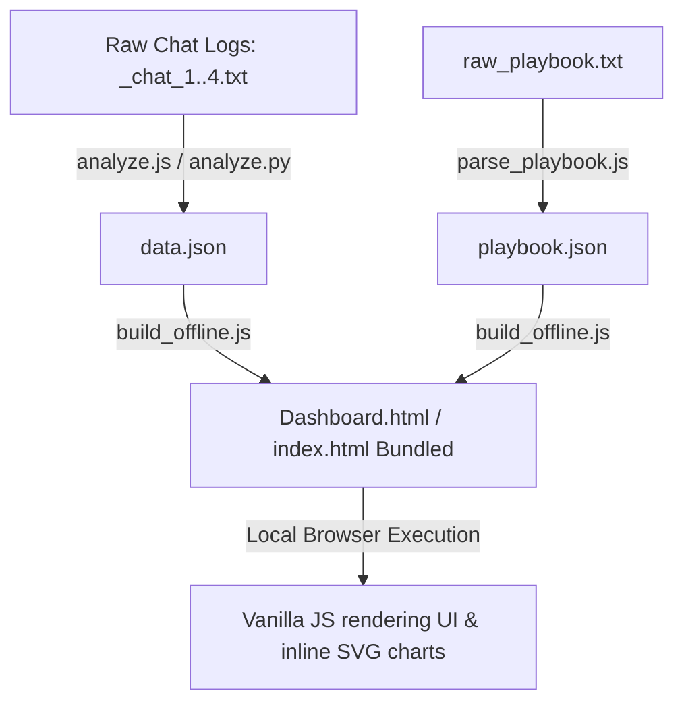

# Dodo Analysis Dashboard & Intelligence Engine

## 1️⃣ Purpose & Scope
- **Overview**: Dodo Analysis is a localized relationship intelligence and sentiment analytics tool. It parses WhatsApp chat history exports (`_chat_*.txt`) between two participants ("Sandra", saved as "My Princess 👸❤️😘", and "Michael", saved as "Michael Mitry") to extract key communication metrics, sentiment patterns, and interaction dynamics.
- **Problem Solved**: Provides structured, data-driven emotional clarity for relationship counseling and personal reflection by analyzing conversation styles, response times, and behavioral tendencies under stress.
- **Core Features**:
  - **Chat Log Parsing & Stitching**: Regex-based ingestion of raw exports that cleans special characters (e.g., Unicode `\u200e` marks) and reconstructs multi-line messages.
  - **Sentiment & Trigger Analysis**: Classifies dialogue using custom multilingual keyword banks (English, Arabizi, and Arabic) for categories including Likes/Loves, Happy/Safety, Sad/Mad, and Breakup/Conflict.
  - **Advanced Relationship Dashboard**: An interactive, premium client-side dashboard featuring:
    - Message frequency metrics (GF vs. BF totals and average response latency).
    - Monthly volume timelines.
    - Daily message volume heatmaps.
    - Radial clock charts mapping hourly "safe zones" vs. high-conflict hours.
    - Donut charts representing core emotional triggers.
    - Categorized message feeds showing exact text excerpts for positive/negative sentiments.
  - **Master Playbook & Strategy System**: Displays a structured carousel of therapeutic advice, translation cards bridging "logic vs. emotion," the 7-day "Steady Baseline" protocol, and an emergency modal for centering focus.
  - **Offline-First Bundling Engine**: Compilation script that merges HTML, CSS, JS, analysis data (`data.json`), and strategy playbooks (`playbook.json`) into a single self-contained HTML file for secure, portable offline execution.

## 2️⃣ Technology Stack & Dependencies
- **Core Languages**: JavaScript (Node.js, ES6 Browser JS), Python, HTML5, CSS3.
- **Frameworks & Libraries**: Vanilla JS (ES6+), CSS Custom Variables, Google Fonts (*Inter*, *Playfair Display*). Charts are rendered using pure dynamic inline SVGs without heavy third-party plotting packages (e.g., Chart.js or D3), keeping the build extremely lightweight.
- **Development & Compilation Tools**: Node.js file system (`fs` and `path` APIs) for parsing text databases and generating offline distributions.
- **Database & Storage**: Flat-file JSON databases (`data.json`, `playbook.json`) and DOM-embedded script tags (`type="application/json"`) for zero-request offline state storage.

## 3️⃣ Project Structure & Key Files
| File Path | Purpose / Description | Key Symbols (Classes, Functions, Constants) |
| --- | --- | --- |
| `analyze.js` | Ingests raw chat logs, performs keyword classifications, calculates response latencies, maps analytics, and writes results to `data.json`. | `pattern`, `likesKeywords`, `happyKeywords`, `sadMadKeywords`, `breakupKeywords`, `extractMatches()`, `generateAdvancedAnalytics()` |
| `analyze.py` | Python alternative to `analyze.js` providing command-line parsing, metrics summary, and context printouts. | `pattern`, `likes_keywords`, `happy_keywords`, `sad_mad_keywords`, `breakup_kws`, `extract_contexts()` |
| `parse_playbook.js` | Parses the plaintext raw playbook file into structured categories and points, exporting to `playbook.json`. | `rawText`, `playbook`, `currentCategory` |
| `therapist_scan.js` | Searches chat logs for vulnerability, conflict, and affection keyword hits, outputting a chronological review file. | `conflictWords`, `vulnerabilityWords`, `affectionWords`, `analyzeCategory()` |
| `deep_therapist_scan.js` | Scans files for specific emotional trigger phrases around critical dates and outputs an in-depth conversation report. | `triggerWords`, `orderedMsgs` |
| `app.js` | Handles client-side initialization, reads dynamic or embedded JSON data, renders SVG visualizations, and controls modals. | `initDashboard()`, `processAndRender()`, `showErrorUI()`, `renderDashboard()`, `renderFeed()`, `renderRadialClock()`, `renderDonutPie()`, `renderTimeline()`, `renderPlaybook()`, `setupEmergencyModal()` |
| `build_offline.js` | Compiles raw assets (`index.html`, `index.css`, `app.js`, `data.json`, `playbook.json`) into unified files (`index.html` and `Dashboard.html`) containing inline CSS/JS and embedded JSON payloads. | `safeData`, `safePlaybook`, `cleanHtml`, `singleHtml` |
| `index.html` | The primary frontend dashboard shell defining container structures, charts, feeds, and modals. | HTML elements: `app-data-payload`, `app-playbook-payload`, `app-logic`, `clock-vis`, `love-vis`, `heatmap-grid` |
| `index.css` | Stylesheet containing custom theme variables, animation keyframes, layout grids, responsive media queries, and styling for cards. | CSS custom properties: `--bg-color`, `--card-bg`, `--glass-border`, `--accent-green`, `--accent-pink`, `--accent-blue` |
| `data.json` | JSON output generated by `analyze.js` containing metrics, monthly logs, heatmaps, and structured text feeds. | JSON root attributes: `stats`, `gfLoveLikes`, `gfHappySafe`, `gfMadSad`, `breakdownHints`, `timeline`, `heatmap`, `timeOfDay`, `loveLanguages`, `avgResponseLatencyMins` |
| `playbook.json` | JSON output generated by `parse_playbook.js` formatting therapeutic categories and points for the carousel. | JSON root schema: `Array<{ category: string, points: string[] }>` |
| `netlify.toml` | Build and cache configurations for deployment on Netlify. | Build command, publish directory, custom headers |
| `package.json` | Manifest mapping build and start commands to execution files. | `scripts: { build, start }` |

## 4️⃣ Setup, Commands & Scripts
### Installation
1. Install Node.js (version 20+ recommended).
2. Install Python (version 3.x if using python analytics script).
3. Clone or copy the files into the workspace directory. No external npm packages are needed as the project relies purely on native Node.js core libraries.

### Running & Analyzing
- **Run Chat Parsing (JS)**:
  ```bash
  node analyze.js
  ```
  This parses the `_chat_*.txt` files and outputs the analyzed data structure to `data.json`.
- **Run Chat Parsing (Python)**:
  ```bash
  python analyze.py
  ```
- **Parse raw playbook text**:
  ```bash
  node parse_playbook.js
  ```
  Processes `raw_playbook.txt` and updates `playbook.json`.
- **Run Specialist Therapist Scans**:
  ```bash
  node therapist_scan.js
  node deep_therapist_scan.js
  ```
  Generates `therapist_report_recent.txt` and `deep_report.txt` with specific contextual logs.

### Bundling (Offline/Production Mode)
- **Compile Unified Build**:
  ```bash
  npm run build
  # or
  node build_offline.js
  ```
  This script packages stylesheet assets, JS code, and the content databases directly into `index.html` and `Dashboard.html`. This creates a fully portable web application that bypasses local CORS restrictions and can be run without an active web server.

### Local Development Server
- To test the "online" fetching mode locally, use a static file server:
  ```bash
  # Using Node (npx)
  npx serve .
  # Using Python
  python -m http.server
  ```
  Then navigate to `http://localhost:3000` or `http://localhost:8000` in the browser.

### Configuration
There are no `.env` files. To customize parameters, edit the variables directly in the scripts:
- **`gfName` / `gf_name`** (default: `"My Princess 👸❤️😘"`): The identifier string of the female participant in chat logs.
- **`bfName` / `bf_name`** (default: `"Michael Mitry"`): The identifier string of the male participant in chat logs.
- **`files`**: The array of text filenames to parse (expects `_chat_1.txt`, `_chat_2.txt`, `_chat_3.txt`, `_chat_4.txt`).

## 5️⃣ Architecture & Key Workflows
### High-Level Architecture
The project utilizes a static pipeline design where backend data computation is fully completed prior to client execution. The pipeline is decoupled as follows:


### Key Workflows
1. **Multi-line Ingestion**: The parser scans each line of the chat exports. If a line matches the timestamp and sender regex pattern, a new message object is initialized. If it doesn't match (e.g., text spans, line breaks, or code snippets), the string is appended to the text property of the currently active message object.
2. **Response Latency Computation**: To calculate response time, the analyzer tracks the timestamp of messages sent by the boyfriend (`bfName`). When a subsequent message is received from the girlfriend (`gfName`), the difference is calculated in minutes. Instances exceeding 24 hours are discarded to prevent sleeping/overnight intervals from skewing the daytime response average.
3. **Trigger Level Normalization**: The heatmap generator counts positive (happy) and negative (conflict) keyword matches per day. The value is normalized by capping positive days at a maximum level of `4` and mapping negative days to a minimum of `-2` so that color thresholds on the UI grid remain balanced and informative.

## 6️⃣ Limitations & Constraints
- **Format Rigidity**: The regex pattern (`/^\[?(\d{2}\/\d{2}\/\d{4},\s\d{1,2}:\d{2}:\d{2}\s?[AP]M)\]?\s(.*?):\s(.*)/`) is configured to read standard WhatsApp text logs exported via iOS (e.g., `[MM/DD/YYYY, H:MM:SS AM/PM] Name: text`). Different locales, Android formats, or platform updates that change the timestamp export layout will cause the parsing engine to skip messages.
- **Hardcoded Directories**: Folder roots (`c:\Users\Mi5a\Documents\dodo analysis`) and filename arrays are hardcoded in variables inside `analyze.js`, `analyze.py`, and scan utilities.
- **Sentiment Keyword Bounds**: Keyword maps are tailored to specific phrases and Arabizi slang (e.g., `ba7eb`, `mabsoot`, `z3lan`, `5alas`). General usage on files from other couples would require updates to the keyword lists.
- **Browser File Restrictions (CORS)**: When running in "online" mode (opening the unbundled `index.html` file directly without a server), modern web browsers will block the async fetch calls to `data.json` and `playbook.json` due to local security guidelines. Users must execute the offline builder or serve files using a web server.
