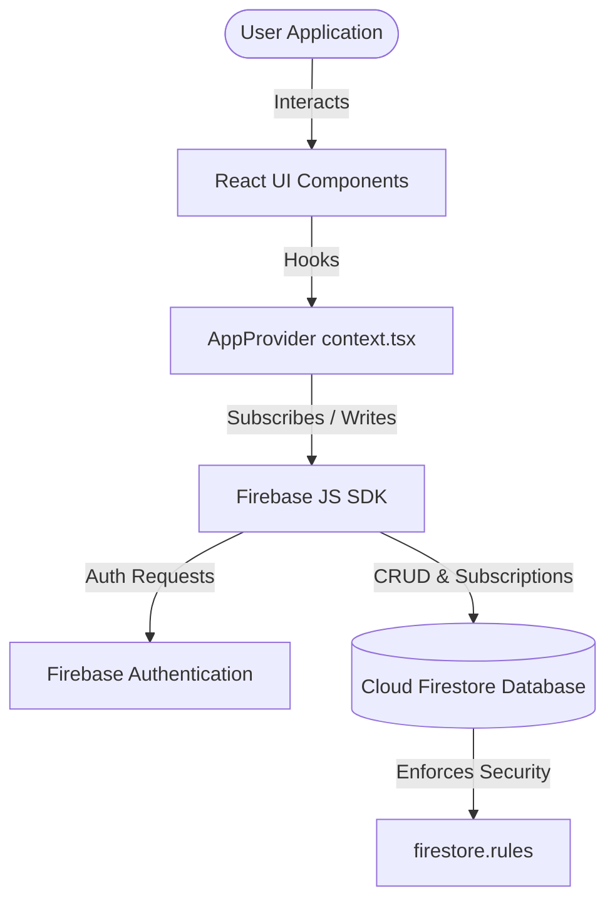

# Strike Boxing CRM

## 1️⃣ Purpose & Scope
Strike Boxing CRM is a customized gym management platform and Customer Relationship Management (CRM) tool developed specifically for the Strike Boxing Club. The system supports gym administrators, managers, and sales representatives in their daily operations.

### Core Features
- **Lead Tracking Pipeline**: Handles lead stages (`New`, `Contacted`, `Visited`, `Negotiating`, `Converted`, `Lost`), interest levels (1-5 stars), sales rep assignment, and activities/comments logging. A conversion wizard turns leads into active members.
- **Active Member Management**: Tracks active client statuses (`Active`, `Expired`, `Nearly Expired`), session balances, package types, and membership start/expiry dates.
- **Member ID Generation**: Auto-generates unique sequential Member IDs starting from `112` via a transactional Firestore counter, guaranteeing no duplicate IDs.
- **Private Sessions & Scheduling**: Integrated date-picker calendar to schedule private sessions. Deducts sessions from members' remaining balances upon attending or not showing up.
- **Payments & Billing**: Logs cash, credit card, bank transfer, and Instapay payments. Validates Instapay transaction references (must be 12 digits). Generates printer-friendly invoice receipts.
- **Role-Based Access Control (RBAC)**: Supports `super_admin`, `crm_admin`, `manager`, `admin`, and `rep` roles:
  - Admins and Managers have global read access. Admins can manage packages, invite users, and alter permissions.
  - Sales Representatives only see leads and clients assigned to them.
  - Role Previewer allows admins to simulate other roles instantly in the UI.
- **Smart Data Import & Rollback**: Imports clients or leads directly from local CSV files or Google Sheets URLs (published as CSV). Auto-maps columns using fuzzy matching and allows one-click batch rollbacks.
- **Audit Logs**: Automatically records administrative actions (creation, deletion, role changes, target modifications, imports/rollbacks) for accountability.

## 2️⃣ Technology Stack & Dependencies
- **Core Languages**: TypeScript, JavaScript, HTML, CSS.
- **Frameworks and Libraries**: React 19 (TypeScript), Vite (build tool), date-fns (date management), PapaParse (CSV parser), Recharts (graphs and charts), Lucide React (icons).
- **Styling**: Tailwind CSS with Shadcn UI components (Radix UI primitives).
- **Backend & Middleware**: Node.js Express server (`server.ts`) acting as a proxy and production host wrapping Vite's runtime middleware.
- **Database & Auth**: Firebase Firestore (real-time data synchronization, transactions, batched writes) and Firebase Authentication (Google Sign-In).
- **Security Rules**: Dedicated Firestore security rules (`firestore.rules`) enforcing document schemas, roles, and write constraints.

## 3️⃣ Project Structure & Key Files
The structure organizes component templates, layout containers, configurations, and core context functions:

### Key Directories
- `src/components/ui/`: Contains Shadcn primitives (Dialog, Button, Input, Table, etc.).
- `src/components/`: Reusable components (e.g. `AlertDialog`, `ConfirmDialog`).
- `src/lib/`: Firebase initialization and setup.

### Key Source Files Map
| File Path | Purpose / Description | Key Symbols (Classes, Functions, Constants) |
| --- | --- | --- |
| `server.ts` | Custom Express server that serves production assets and acts as a Vite dev server wrapper in local environments. | Express instance, Vite dev server middleware setup |
| `firestore.rules` | Security rules for Firebase Firestore. Restricts client, payment, task, package, and user read/write privileges based on authentications and roles. | `service cloud.firestore`, rules matches, custom check helpers |
| `src/types.ts` | Core TypeScript interfaces and type declarations for CRM models. | `Client`, `Payment`, `Package`, `Task`, `PrivateSession`, `UserRole`, `LeadStage`, `AuditLog`, `BrandingSettings` |
| `src/context.tsx` | App State Context; initializes Firestore connection, runs live subscriptions, handles auth, and manages CRUD transaction utilities. | `AppProvider`, `useAppContext`, `generateMemberId`, `addClient`, `bulkAddClients`, `updateClient`, `rollbackImport`, `cleanData` |
| `src/App.tsx` | Main application shell containing routing structure, layout shell, auth checks, and navigation. | `App`, `Header`, navigation tabs configuration |
| `src/Dashboard.tsx` | Displays statistics dashboard, revenue metrics, conversion funnels, and branch revenue breakdowns. | `Dashboard`, metrics calculations, charts components |
| `src/Clients.tsx` | Member listing page including searching, branch/status filtering, activity logging, and bulk operations. | `Clients`, `ClientRow`, Client Edit Drawer |
| `src/Leads.tsx` | Pipeline board and leads management list. Supports stage/rep batch re-assignments and conversion to active members. | `Leads`, bulk actions, `confirmConversion` dialog |
| `src/Payments.tsx` | Record client payments, reference available packages, validate Instapays, and render printable invoices. | `Payments`, `handleAddPayment`, `printInvoice` |
| `src/PrivateSessions.tsx` | Interactive session scheduler calendar. Logs session attendance and deducts package balances. | `PrivateSessions`, `handleUpdateStatus` |
| `src/ImportData.tsx` | Handles CSV uploading and fuzzy-alias matching for headers. Performs Firestore chunk write batches. | `ImportData`, fuzzy alias mappings, `Papa.parse`, `performImport` |
| `src/ImportHistory.tsx` | Lists batch import events with batch-wide rollback deletion. | `ImportHistory`, `handleRollback` |
| `src/Users.tsx` | Admin management panel to invite new emails and assign roles. | `Users`, role selectors, email invite triggers |
| `src/Packages.tsx` | Defines gym packages specifying prices, expiry durations, session allowances, and branch limits. | `Packages`, `handleAdd`, `handleEdit`, `confirmDelete` |
| `src/AuditLogs.tsx` | Displays live chronological logs of all database actions recorded under `auditLogs`. | `AuditLogs`, action filters, pagination |

## 4️⃣ Setup, Commands & Scripts
Follow these steps to initialize, configure, and execute the application:

### Installation
Install the project dependencies locally:
```bash
npm install
```

### Environmental Configuration
Ensure your Firebase project is set up and add the appropriate configuration object in `src/lib/firebase.ts`. Set up your environment variables if needed or copy the Firebase configuration keys directly into:
- `src/lib/firebase.ts`

### Running Locally
To launch the Vite development server locally:
```bash
npm run dev
```
Alternatively, to start the application with the custom Express server script:
```bash
npx ts-node server.ts
```

### Building for Production
To bundle assets for production hosting:
```bash
npm run build
```

## 5️⃣ Architecture & Key Workflows

### Data Flow Overview


### Key Administrative Workflows
1. **Google Auth & Role Matching**:
   Upon authentication via Google Sign-In, the application matches the authenticated email with an existing document in the `users` collection to retrieve the assigned role. If no record is found, the user remains in a restricted unauthorized state.
2. **Sequential Member ID Transaction**:
   When client conversion occurs or a new Active client is registered, `generateMemberId()` is executed. It performs a transaction (`runTransaction`) on `counters/clients` to retrieve `lastId`, increment it, set the new counter value, and return the unique sequential ID.
3. **Data Import & Rollback Correlation**:
   CSV data is mapped automatically. Upon import, a new `importBatches` document is generated with a unique ID. All created clients are tagged with this `importBatchId`. If rollback is triggered, a database query retrieves all clients matching the batch ID and deletes them, then updates the batch status to `Rolled Back`.

## 6️⃣ Limitations & Constraints
- **Google Sheets CORS Restrictions**: When using the URL import feature, the Google Sheet MUST be published to the web as a CSV (`File > Share > Publish to web > CSV`) to bypass CORS blocks. Standard sharing links will fail to fetch.
- **Client-Side Filtering**: Client visibility filtering based on role assignment (e.g. Sales Reps only viewing assigned records) is computed in the React `useMemo` layer (`visibleClients`). Ensure your Firestore Security Rules (`firestore.rules`) match these access controls to prevent direct database queries from bypassing UI restrictions.
- **Instapay String Validation**: The Instapay reference validator accepts exactly 12 digits (`/^\d{12}$/`). If the reference length is changed by the payment network, this validation regex in `Payments.tsx` must be updated.
