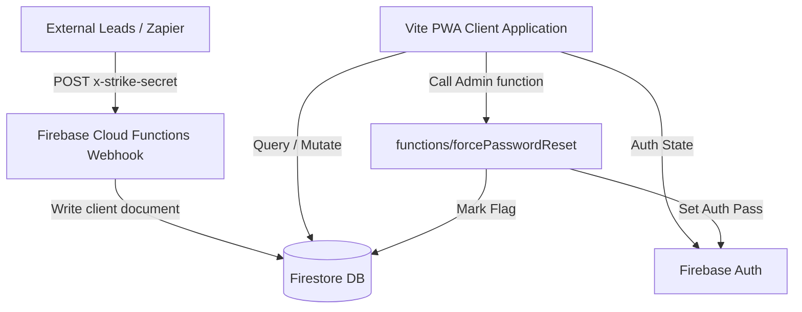

# Strike Boxing CRM

## 1️⃣ Purpose & Scope
Strike Boxing CRM is a customized CRM and management system designed specifically for the operations of Strike Boxing Club. The application facilitates member relationship management, lead ingestion/tracking, staff/coach authorization, payment tracking, attendance check-ins, and task assignments across multiple branches. It provides a secure, role-based dashboard for managers, sales representatives, coaches, and clients.

### Core Features:
- **Lead Ingestion & Management:** Automated lead capture from external platforms (Meta Ads via Zapier/Make.com webhooks) and manual pipeline stage updates (New, Trial, Follow Up, Converted, Lost).
- **Payment & Upgrade Tracking:** Secure payment recording with support for discounts, payment methods (Cash, Credit, Instapay, Bank Transfer), and package upgrading. It features a transaction-level upgrade flow to transfer old payments and prevent package duplication.
- **Attendance & Public Kiosk:** Members can check in by scanning their member IDs or entering their phone numbers. The kiosk mode supports daily PIN validation and auto-decrements remaining sessions.
- **Role-Based Permissions:** Permissions are dynamically governed (e.g., global dashboard views, settings configuration, payment deletion, lead assignment) according to a role hierarchy (`crm_admin` > `super_admin` > `admin` > `manager` > `rep`).
- **Data Portability:** Supports smart column mapping for CSV imports, automated database backups to JSON, and full system restore functions.
- **Contracts Generation:** PDF contract templates are filled automatically using client details and payment information.
- **Multi-Tenant Sharing:** The Firebase database rules accommodate multiple projects simultaneously (Matchmaking, ATPL Vector, GAMÉN) by isolating data collections using paths and prefix matches.

## 2️⃣ Technology Stack & Dependencies
- **Core Languages:** TypeScript, HTML/CSS
- **Frameworks & Libraries:**
  - **React 19:** View layer and context state management.
  - **Vite 6:** Frontend builder and development server.
  - **Firebase SDK (v12):** Authentication, Firestore (NoSQL DB), Storage, and Cloud Functions.
  - **Express:** Core server router configuration.
  - **Tailwind CSS (v4):** Styling engine with CSS-first configuration.
  - **Lucide React:** Icon set.
  - **Recharts:** Analytics charts.
  - **PapaParse:** CSV parsing library for imports.
  - **PDF-Lib:** PDF generation and contract filling.
  - **Date-Fns:** Date operations and formatting.
- **Development & Packaging:**
  - **Esbuild:** Backend bundle compilation.
  - **Vite Plugin PWA:** Configured to support offline and Progressive Web App functionality.
- **Database/Storage:**
  - **Firebase Firestore:** Core database.
  - **Firebase Auth:** User directory.
  - **Firebase Storage:** Logo and avatar uploads.
  - **Local Offline Cache:** Configured in Firestore with multiple-tab persistent local cache managers.

## 3️⃣ Project Structure & Key Files
### Directory Summary:
- `/src`: Application source code (React UI, context, hooks, and services).
- `/public`: Static assets including contract PDF template.
- `/functions`: Firebase Cloud Functions backend.
- `/dist` / `/dist-server`: Build outputs for frontend and node server respectively.

### Key Source Files & Responsibilities:
| File Path | Purpose / Description | Key Symbols (Classes, Functions, Constants) |
| --- | --- | --- |
| `src/firebase.ts` | Firebase Client Initialization & secondary app instance helpers | `auth`, `db`, `storage`, `createFirebaseUser`, `getExistingUserUID` |
| `src/context.tsx` | Main application context, aggregating hooks & Kiosk logic | `AppProvider`, `useAppContext`, `selfCheckIn`, `wipeSystem` |
| `src/contexts/AuthContext.tsx` | Manages role hierarchy, user sessions, and permission checks | `AuthProvider`, `useAuth`, `effectiveRole`, `ADMIN_ROLES` |
| `src/contexts/SettingsContext.tsx` | Handles gym settings, branch registrations, and branding properties | `SettingsProvider`, `useSettings`, `branding`, `branches` |
| `src/types.ts` | Type definitions for clients, payments, audit logs, and configurations | `Client`, `Payment`, `User`, `UserRole`, `isSuperAdmin`, `isAdmin` |
| `src/services/transactionService.ts` | Database transactions for payments & package upgrades | `processPaymentTransaction`, `PaymentTransactionParams` |
| `src/services/clientService.ts` | Handles client modifications, member ID generators, and attendance updates | `addClient`, `generateMemberId`, `recordSessionAttendance` |
| `src/services/userService.ts` | Manages user accounts creation, invitation, and activation | `inviteUser`, `activatePendingUser`, `updateUser` |
| `src/utils/pdfGenerator.ts` | Modifies PDF form fields dynamically to compile contracts | `generateClientContract` |
| `src/ImportData.tsx` | UI for file mapping, column parsing, and smart bulk uploads | `ImportData`, `performImport` |
| `firestore.rules` | Security rules for Strike CRM, Matchmaking, ATPL, and GAMÉN databases | `isStrikeAdmin`, `canStrikeDeletePayments`, `isValidClient`, `isValidMatch` |
| `functions/src/index.ts` | Cloud Functions endpoints, webhooks, and firestore triggers | `forcePasswordReset`, `metaWebhook`, `onLeadCreated`, `onClientAssigned` |
| `functions/src/utils/mailer.ts` | Formulates templates and dispatches SMTP emails via Nodemailer | `sendEmail`, `sendNewLeadEmail`, `sendAssignmentEmail` |

## 4️⃣ Setup, Commands & Scripts
### Installation:
```bash
npm install
cd functions
npm install
```

### Running Locally:
```bash
# Start frontend dev server
npm run dev

# Start functions emulator (inside functions directory)
npm run serve
```

### Building:
```bash
# Compiles frontend assets and bundles server.ts with esbuild
npm run build
```

### Starting (Production Node Server):
```bash
npm start
```

### Linting:
```bash
npm run lint
```

### Environmental Configuration:
- **`firebase-applet-config.json`**: Located in the root directory. Required for client-side Firebase initialization.
  - Fields: `projectId`, `appId`, `apiKey`, `authDomain`, `storageBucket`, `messagingSenderId`, `measurementId`.
- **`.env`**: Located in the root directory (optional overrides).
  - Variables: `PORT`, `NODE_ENV`, and `VITE_FIREBASE_*` variables.
- **Firebase Functions Secrets**:
  - `SMTP_HOST`, `SMTP_PORT`, `SMTP_USER`, `SMTP_PASS`, `FROM_EMAIL`: Nodemailer email configuration.
  - `STRIKE_WEBHOOK_SECRET`: Secure webhook verification key for the meta webhook.

## 5️⃣ Architecture & Key Workflows
### High-Level Data Flow:


### Key Workflows:
1. **Lead Webhook Ingestion (`metaWebhook`):** Receives leads from Zapier/Make.com. Verifies token payload against `STRIKE_WEBHOOK_SECRET`. Creates a new document in the `clients` collection with `status: "Lead"`. This triggers `onLeadCreated` which notifies sales representatives via email.
2. **Member Package Upgrading (`processPaymentTransaction`):** Implemented using a Firestore Transaction to guarantee database read-write isolation. If a member upgrades their package, it:
   - Queries previous payment candidates under the older package name.
   - Updates old payment category/name and tracks them with a `wasTransferredDueToUpgrade` flag.
   - Marks the older package status to `Expired` and appends the new `Active` package.
   - Creates a transaction log / comment and updates client stats.
3. **Daily Kiosk Check-In (`selfCheckIn`):** Public-facing portal checks member credentials anonymously. Checks PIN against settings, locates member profile, verifies expiration date and session availability. Writes to the `attendance` collection and decrements the client's `sessionsRemaining` count.

## 6️⃣ Limitations & Constraints
- **Hardcoded Admins:** High-level admin checks are hardcoded to specific emails (`michaelmitry13@gmail.com`, `magd.gallab@gmail.com`, `admin@strike.eg`) both inside `firestore.rules` and `AuthContext.tsx` to handle authentication override and initial system setup.
- **Cross-Origin Imports:** Importing from Google Sheets via URL in the browser requires the sheet to be explicitly "Published to the web" as CSV, otherwise browser CORS policy will reject the request.
- **Anonymous Sign-In:** The check-in kiosk runs on an anonymous Firebase authentication session. The security rules are configured to permit anonymous reads/writes strictly on the `clients` (limited field verification) and `attendance` tables.
- **Project Co-existence:** Multiple distinct project collections (e.g. `match_*` for Matchmaking, `atpl_*` for ATPL Vector) share the same Firebase Firestore instance. Extra caution is required when modifying global configuration indices or rules to prevent breaking cross-app dependencies.
- **PWA Precache Limits:** PWA caching has been forced to 5MB (`maximumFileSizeToCacheInBytes: 5 * 1024 * 1024` in `vite.config.ts`) because client-side split vendor bundles easily exceed standard PWA sizes.
